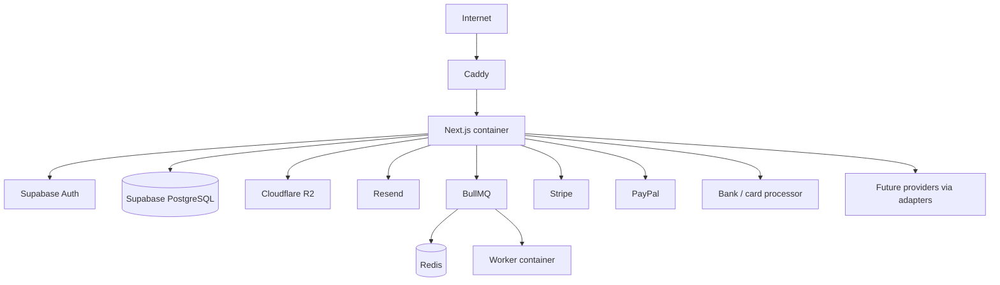

# Architecture

This note is the architecture overview. Accepted stack and payment rules live in [[05 Architecture Decisions]] and [[Engineering Rules]]. Product requirements remain in the module documents. See [[01 Master Spec]].

## Approved Stack (authoritative)

| Area | Choice | ADR |
| --- | --- | --- |
| Application | Next.js App Router, TypeScript, Node.js, pnpm | [[05 Architecture Decisions#ADR-001 — Application framework]] |
| UI | Tailwind CSS, shadcn/ui, React Hook Form, Zod, TanStack Table | [[05 Architecture Decisions#ADR-012 — UI stack]] |
| Database / ORM | Supabase PostgreSQL + Prisma | [[05 Architecture Decisions#ADR-002 — Database]] |
| Identity | Supabase Auth | [[05 Architecture Decisions#ADR-003 — Authentication]] |
| Authorization | Application database / domain | [[05 Architecture Decisions#ADR-003 — Authentication]] |
| Money | Prisma Decimal + PostgreSQL NUMERIC/DECIMAL | [[05 Architecture Decisions#ADR-004 — Money representation]] |
| Jobs | BullMQ + Redis + dedicated worker | [[05 Architecture Decisions#ADR-005 — Background jobs]] |
| Storage | Cloudflare R2 via S3-compatible StorageService | [[05 Architecture Decisions#ADR-006 — Object storage]] |
| Email | Resend via EmailService | [[05 Architecture Decisions#ADR-007 — Transactional email]] |
| Payments | Provider registry + capability adapters | [[05 Architecture Decisions#ADR-008 — Payment provider architecture]] |
| PDF | React-pdf (`@react-pdf/renderer`) | [[05 Architecture Decisions#ADR-013 — PDF generation]] |
| Logging | Pino | [[05 Architecture Decisions#ADR-014 — Logging]] |
| Monitoring | Sentry | [[05 Architecture Decisions#ADR-015 — Monitoring]] |
| Tests | Vitest + Playwright | [[05 Architecture Decisions#ADR-016 — Testing]] |
| Deploy | Docker + Linux VPS + Caddy | [[05 Architecture Decisions#ADR-017 — Deployment]] |
| CI | GitHub Actions | [[05 Architecture Decisions#ADR-018 — CI/CD]] |

Do not introduce a separate Express/Nest backend. [[05 Architecture Decisions#ADR-020 — Next.js server layer|ADR-020]]

## Architecture Overview

Internal web-based multi-brand invoicing and payment-management platform. One master application, isolated companies.



## Application Layers

```text
UI / HTTP Boundary (Server Components, Client Components, Route Handlers, Server Actions)
        ↓
Application Services
        ↓
Domain Services
        ↓
Repositories / Integrations
        ↓
PostgreSQL / External Providers
```

| Layer | Rule |
| --- | --- |
| UI | Tailwind + shadcn/ui. Client Components only where interactivity is required. |
| Forms | React Hook Form + Zod for UX. Backend/domain validation is authoritative. |
| Tables | TanStack Table with **server-side** pagination/sort/filter. Do not load large financial datasets into the browser. |
| HTTP | Route Handlers / Server Actions coordinate use cases. They must not contain core domain logic. |
| Domain | Reusable, independently testable. Central money layer. Provider-neutral payments. |
| Data | Prisma + PostgreSQL constraints. UTC timestamps. |

Source requirements: [[Data Model]], [[API and Integrations]], [[Deployment]], [[05 Architecture Decisions]]

## Domain Boundaries

| Domain | Authoritative document |
| --- | --- |
| Authentication, users, roles, company assignments | [[Roles and Permissions]], [[Security]], [[05 Architecture Decisions#ADR-003 — Authentication]] |
| Companies / brands / reporting groups | [[Companies and Brands]] |
| Currency, fixed rates, rounding | [[Currency and Conversion]] |
| Customers | [[Customers]] |
| Invoices, numbering, lifecycle | [[Invoices]] |
| PDF and email delivery | [[PDF and Email]], [[Notifications]] |
| Payments, gateways, webhooks | [[Payments]], [[API and Integrations]], [[05 Architecture Decisions#ADR-008 — Payment provider architecture]] |
| Refunds, disputes, chargebacks | [[Refunds Disputes Chargebacks]] |
| Compliance | [[Compliance]] |
| Audit | [[Audit Logs]] |
| Reporting | [[Dashboard and Reporting]] |
| Settings | [[Settings]] |

Do not infer missing rules from an unrelated domain. See [[01 Master Spec]].

## Data Flow

1. Supabase Auth establishes identity. The application user record maps to that identity.
2. The application domain checks status, role, permission, and company access.
3. Company-scoped writes are transactional in PostgreSQL.
4. Cross-currency payments snapshot the Admin-defined fixed rate. Gateways never override it.
5. Provider webhooks are verified, idempotent, and may be post-processed on the worker.
6. PDFs, email, and large exports use StorageService / EmailService / BullMQ as appropriate.
7. Privileged actions write append-only **application** audit events. Pino logs are operational, not the audit trail.

## Tenant / Company Isolation Model

Every transactional table must include `company_id` directly or through an enforced relationship.

Every company-scoped operation must validate, server-side:

1. authenticated identity
2. application user status
3. role/permission
4. company assignment/access
5. permission for the requested operation

Frontend hiding is not authorization. URL manipulation, Route Handlers, Server Actions, API requests, and modified client payloads must still be denied.

Apply consistently to customers, invoices, payments, payment adjustments, gateway configuration, compliance, reports, exports, files, audit access, and settings.

- Admin may access all companies.
- Compliance and Staff see only assigned companies.
- Admin "All Companies" is for consolidated reporting only. Transactional actions must always select one concrete company.
- Reporting Groups are roll-up reporting only and do not weaken company-level access controls.

Sources: [[Companies and Brands]], [[Roles and Permissions]], [[Security]], [[Business Rules]] BR-016, [[Engineering Rules]]

## Authentication and Authorization Boundaries

```text
authenticated ≠ authorized
```

- Supabase Auth: who is this user?
- Application DB/domain: what may they do, and for which company?
- RBAC: Admin, Compliance, Staff, plus company assignment.
- MFA remains strongly recommended for Admin and Compliance.
- Processor credentials only for backend services and authorized Admin configuration.

Sources: [[Roles and Permissions]], [[Security]], [[05 Architecture Decisions#ADR-003 — Authentication|ADR-003]]

## Financial Domain Boundaries

Financial history is immutable. Independent records must not be silently recalculated:

- original invoice amount/currency
- fixed conversion-rate snapshot
- converted settlement amount
- payment record
- merchant/processor fee
- actual amount received
- refunds, disputes, and chargebacks

Confirmed/successful payment financial fields are read-only. Corrections use adjustment/reversal workflows.

Authoritative money: Prisma Decimal / PostgreSQL NUMERIC. Never JavaScript `number` arithmetic for money. Centralize formulas in the financial domain layer.

Sources: [[Product Overview]], [[Currency and Conversion]], [[Payments]], [[Data Model]], [[Business Rules]], [[05 Architecture Decisions#ADR-004 — Money representation|ADR-004]]

## Payment Provider Abstraction

Version 1 providers: Stripe, PayPal, generic bank/card processor, Manual Payment.

Future providers (not Version 1 scope) may include Authorize.Net, Adyen, Braintree, Checkout.com, Square, and local acquirers. Adding one must not redesign the payment domain.

```text
Payment Domain → Payment Application Service → PaymentProvider Registry → Adapters
```

Capabilities instead of provider-name conditionals in core logic. Normalized Pending/Successful/Failed. Adjustments for refunds/disputes/chargebacks. Manual payments use the same domain without fake webhooks.

Merchant fees never change invoice balance, rate, or converted settlement.

Details: [[05 Architecture Decisions#ADR-008 — Payment provider architecture|ADR-008]]

## Background Processing

BullMQ + Redis + dedicated worker. PostgreSQL remains the financial source of truth. Redis is not an authoritative financial store.

## Object Storage

Application → StorageService → S3-compatible adapter → Cloudflare R2. Metadata in PostgreSQL.

## Transactional Email

Application → EmailService → EmailProvider → ResendAdapter. Invoice remains issued if email fails.

## Audit Architecture

Append-only application audit trail, distinct from Pino logs and from Sentry. Never store secrets in audit rows. Payment events (create/confirm/fail, refunds, disputes, chargebacks, manual confirmation, gateway config) generate application audit events.

Source: [[Audit Logs]], [[Business Rules]] BR-015

## Reporting Architecture

Provider-neutral: reports operate on normalized application payment records. A later adapter should appear in generic gateway reporting once records are normalized.

Do not mix unlabeled currencies. Use stored Admin rate snapshots. Fees displayed separately. Open disputes do not deduct CB/RF.

Reporting/base currency remains configurable (ADR-011 OPEN).

Sources: [[Dashboard and Reporting]], [[Definitions]], [[Business Rules]]

## Integration Boundaries

| Integration | Boundary |
| --- | --- |
| Stripe / PayPal / bank / future | Adapter + capabilities + signed webhooks; no PAN/CVV |
| Manual payment | Same domain; no fake webhooks |
| Resend | EmailProvider only |
| R2 | StorageService / S3 adapter only |
| No live FX | Admin-defined fixed rates only |

Customer portal is out of scope. Hosted checkout links are allowed.

## Deployment Overview

| Environment | Purpose |
| --- | --- |
| Local | Developer workstation |
| Development | Shared development integration |
| Staging/UAT | Production-like acceptance and gateway sandbox tests |
| Production | Live credentials and protected data |

Production: Caddy → Next.js container; worker container; Redis container; managed Supabase PostgreSQL off-VPS. Exact VPS vendor is operational and still open.

Source: [[Deployment]], [[05 Architecture Decisions#ADR-017 — Deployment|ADR-017]]

## Dates and time

Store authoritative timestamps in UTC. Display in user/company timezone. Payment effective dates and business dates remain distinct from system timestamps where the spec requires it.

## Open Implementation Choices

| ID | Topic | Status |
| --- | --- | --- |
| [[05 Architecture Decisions#ADR-009 — Issued invoice financial edit policy]] | Issued invoice financial edit policy | OPEN |
| [[05 Architecture Decisions#ADR-010 — Discount model]] | Discount model | OPEN |
| [[05 Architecture Decisions#ADR-011 — Reporting/base currency default]] | Reporting/base currency default | OPEN |
| Operational | Exact VPS vendor, DNS/domain | OPEN |
| Deferred | Future gateways, alt email/S3 vendors | Adapter-shaped; not Version 1 |

## Related Documentation

- [[01 Master Spec]]
- [[05 Architecture Decisions]]
- [[Engineering Rules]]
- [[Data Model]]
- [[API and Integrations]]
- [[Security]]
- [[Deployment]]
- [[Architecture]]
