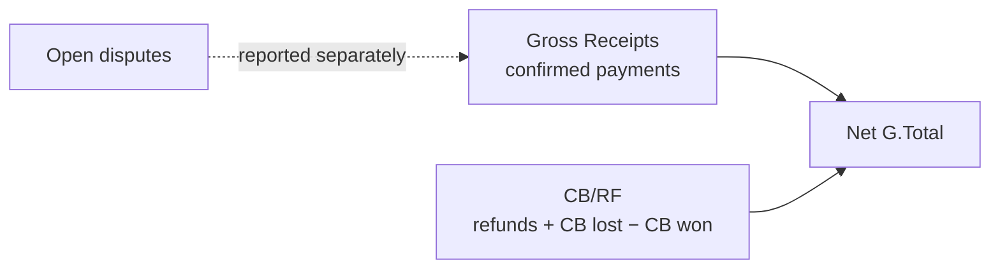

# Dashboard and Reporting

> [!abstract] Related
> [[Companies and Brands]] · [[Payments]] · [[Refunds Disputes Chargebacks]] · [[Currency and Conversion]] · [[Compliance]] · [[00 Home]]

> [!warning] Do not mix currencies
> If a report contains multiple original currencies, show separate totals or convert each record using **stored** Admin fixed-rate snapshots. Label converted values as equivalents. Merchant fees must not alter conversion totals.

### 13.1 Dashboard KPIs

| KPI | Definition |
| --- | --- |
| Total Invoiced | Invoice value for selected filters; display original-currency breakdown and optional reporting-currency equivalent. |
| Total Paid | Invoice-currency value applied by confirmed payments. |
| Outstanding | Open invoice balance. |
| Overdue | Outstanding balance where due date is past and invoice is not paid/cancelled. |
| Converted Settlement | Confirmed settlement equivalent calculated using stored Admin fixed-rate snapshots. |
| Processor / Merchant Fees | Optional confirmed fee totals by settlement currency; displayed separately and never deducted from converted settlement totals. |
| Actual Amount Received | Optional confirmed/recorded received amounts by settlement currency, where this field is used. |
| Invoice Count | Count by status. |
| Payment Count | Count by method/status. |

### 13.2 Required Filters

- Date range

- Company / All Companies

- Customer

- Staff

- Invoice status

- Payment status

- Payment method/gateway

- Invoice currency

- Settlement currency

- Country

- Compliance status

- Reporting Group / Parent Company

- Adjustment type (Refund / Dispute / Chargeback / Reversal)

- Reporting year / month

- Gross / CB-RF / Net view

### 13.3 Required Reports

| Report | Minimum Output |
| --- | --- |
| Invoice Report | Invoice number, customer, company, dates, currency, total, paid, balance, status, staff. |
| Payment Report | Invoice, customer, method, transaction ID, invoice amount applied, fixed rate snapshot, converted settlement amount, optional fee, optional actual received amount, currency, date, status. |
| Outstanding Report | Invoice, customer, due date, age, currency, outstanding, company, staff. |
| Overdue Aging | Buckets such as 1-30, 31-60, 61-90, 90+ days. |
| Customer Report | Total invoiced/paid/outstanding by customer and currency. |
| Company Performance | Invoice and settlement KPIs by company. |
| Staff Performance | Invoices created/sent, value invoiced, collections linked to assigned invoices; avoid implying staff commission unless separately defined. |
| Gateway Report | Transactions, converted settlement totals, optional merchant fees, optional actual received amounts, failures, refunds by gateway and settlement currency. |
| Currency Report | Invoice totals by invoice currency and settlement totals by settlement currency. |
| Compliance Report | Review counts, approved/flagged/pending, aging and notes references. |
| Monthly Brand / CB-RF Report | Spreadsheet-style report with January-December rows, brand/company columns, Monthly Total, CB/RF, G.Total, annual summary, and reporting-group rollup such as VX. |
| Refund & Chargeback Report | Original payment, customer, invoice, brand/company, adjustment type/status, amount, settlement currency, merchant case/reference ID, reason, opened/processed/resolved dates, created by, and financial impact. |

#### 13.3.1 Monthly Brand / Company Matrix Report

The application must provide a report closely matching the supplied spreadsheet. By default this report is based on payment received/effective date, not invoice creation date, with an optional report-basis selector if required later.

Default columns: each brand/company inside the selected Reporting Group, followed by Monthly Total and CB/RF. Default rows: January through December plus G.Total.

Gross brand/month values = sum of confirmed/successful customer payments for that brand and month in the selected reporting currency. CB/RF = processed refunds + chargeback debits/losses - chargeback won/reversal amounts. Open disputes with no financial debit are shown separately and do not reduce revenue.

Annual Gross Total = sum of confirmed payments. Net G.Total = Annual Gross Total - CB/RF. Provide summary blocks for current-month totals and yearly reporting-group/company totals similar to the reference.

Every amount must support drill-down to underlying payments/adjustments. Excel/CSV/PDF exports must preserve selected filters and totals.

Reference reporting layout supplied by Product Owner.

| Gross Receipts | Sum of Successful/Confirmed payments within selected scope. |
| --- | --- |
| CB/RF | Processed Refunds + Chargeback Debits/Losses - Chargeback Won/Reversal amounts. Shared domain helpers: `computeCbrf` / `computeReportingNetTotals` (TASK-070). |
| Net G.Total | Gross Receipts - CB/RF (`computeNetGTotal`). |
| Open Disputes | Reported separately (`sumOpenDisputeAmounts`); no deduction until a refund/merchant debit is recorded. |
| Merchant fees | Never included in Gross Receipts, CB/RF, or Net G.Total. |

### 13.4 Multi-Currency Reporting Rule

> [!warning] Do not mix currencies
> Do not mix currencies If a report contains multiple original currencies, show separate currency totals or convert each record to a defined reporting currency using stored Admin fixed-rate snapshots. The UI must clearly label converted values as equivalents and retain drill-down to original amounts. Merchant fees must not be used to alter currency-conversion totals.

### 13.5 Export Formats

- CSV for all tabular reports.

- XLSX recommended for business users.

- PDF optional for summary reports.

- Export action logged in audit history.

### Implementation (TASK-077 / TASK-078 / TASK-079 / TASK-080 / TASK-081 / TASK-082 / TASK-083 / TASK-084 / TASK-085 / TASK-086 / TASK-087 / TASK-088 / TASK-090 / TASK-098)

- Dashboard KPIs on `/` (`dashboard.view`): Total Invoiced / Paid / Outstanding / Overdue by invoice currency; Converted Settlement from stored payment snapshots by settlement currency; processor fees and actual received shown separately (never deducted from settlement).
- Invoice and payment counts by status (and method for payments).
- Filters (§13.2 as applicable): date range, company, customer, staff, reporting group, invoice/payment status, method, invoice/settlement currency, country, compliance status.
- Invoice Report on `/reports/invoices` (`report.view`): §13.3 columns with pagination/filter/sort; `GET /api/reports/invoices`.
- Payment Report on `/reports/payments` (`report.view`): §13.3 columns including stored fixed-rate snapshot, converted settlement, optional fee and actual received; `GET /api/reports/payments`. Stored snapshots only — never live FX.
- Outstanding Report on `/reports/outstanding` (`report.view`): §13.3 columns (invoice, customer, due date, age, currency, outstanding, company, staff); open collectible balances only; cancelled excluded by default (BR-019); stored outstanding (BR-009); `GET /api/reports/outstanding`.
- Overdue Aging on `/reports/overdue-aging` (`report.view`): buckets 1–30 / 31–60 / 61–90 / 90+ with per-currency outstanding totals and invoice counts; BR-018 past-due open balances only; draft never aged; `GET /api/reports/overdue-aging`.
- Customer Report on `/reports/customers` (`report.view`): total invoiced / paid / outstanding by customer and invoice currency; pagination/filter/sort; draft/cancelled excluded; `GET /api/reports/customers`.
- Company Performance on `/reports/companies` (`report.view`): invoice and settlement KPIs by owning company; reporting group filters scope only (never ownership); pagination/filter/sort; `GET /api/reports/companies`.
- Staff Performance on `/reports/staff` (`report.view`): invoices created/sent, value invoiced, collections linked to assigned invoices; commission not calculated; pagination/filter/sort; `GET /api/reports/staff`.
- Gateway Report on `/reports/gateways` (`report.view`): transactions, converted settlement, optional fees/actual received, failures, and refunds by gateway × settlement currency; fees never deducted (BR-020); pagination/filter/sort; `GET /api/reports/gateways`.
- Currency Report on `/reports/currencies` (`report.view`): invoice totals by invoice currency and settlement totals by settlement currency; currencies stay labeled (BR-013); fees never deducted (BR-020); `GET /api/reports/currencies`.
- Compliance Report on `/reports/compliance` (`report.view` + `compliance.review`; Staff denied): review counts (approved/flagged/pending), aging of pending/flagged, notes references; `GET /api/reports/compliance`. Read-only — no audit manipulation.
- Monthly Brand / CB-RF Matrix on `/reports/monthly-brand` (`report.view`): Jan–Dec + G.Total rows; brand/company columns; Monthly Total; CB/RF; Net G.Total; annual and current-month summary; gross by payment date and CB/RF by adjustment effective date; amounts in configured reporting currency via stored snapshots; drill-down payment/adjustment IDs; open disputes separate (BR-024 / BR-026); `GET /api/reports/monthly-brand`.
- Reporting Group Rollups on `/reports/reporting-groups` (`report.view`): dashboard KPIs and monthly-matrix summary blocks rolled up by reporting group; one/all groups or single-brand scope; group membership narrows scope only — never ownership or authorization; Staff limited to assigned companies within a group; `GET /api/reports/reporting-groups`.
- Report exports (TASK-090): CSV for all tabular reports; XLSX recommended; server-side generation via inline job dispatcher (ADR-005; TASK-099 hardens BullMQ); files stored in StorageService with `report_exports` metadata; preserves selected filters and totals; `POST /api/reports/exports`, `GET /api/reports/exports/[id]`, `GET /api/reports/exports/[id]/file`; requires `report.export` (Staff denied by default — US-009); compliance report export also requires `compliance.review`; audited as `reports.exported` (BR-015); Export CSV/XLSX on each report page when allowed.
- Performance (TASK-098): invoice, customer, and payment operational lists use server-side pagination (default 50, max 100); p95 target under ~2 seconds for standard authenticated list/report APIs under normal load; full report dumps stay on export jobs (TASK-090) rather than unbounded browser/API lists. Additional indexes on invoice number, staff visibility, dates, transaction IDs, and report filters.
- Company switcher remains the header scope control; Staff limited to assigned companies and own/assigned invoices.
- `GET /api/dashboard` returns the same KPI payload. No unlabeled mixed-currency totals (BR-013). ADR-011 reporting-currency rollup not invented.

## Related Documentation

### Depends On

- [[Companies and Brands]]
- [[Payments]]
- [[Currency and Conversion]]
- [[Refunds Disputes Chargebacks]]

### Integrates With

- [[Compliance]]
- [[Invoices]]
- [[Customers]]

### Technical

- [[02 Current Product Rules]]
- [[Testing]]

> [!danger] Fixed conversion rates
> Rates are Admin-defined and versioned. Historical payments retain the exact rate snapshot used. Changing a rate affects future transactions only. Never fetch, guess, or substitute a market/gateway rate.
> Also see [[Currency and Conversion]] · [[Payments]] · [[02 Current Product Rules]] · [[Data Model]] · [[Dashboard and Reporting]] · [[Testing]]

> [!tip] Merchant fees
> Merchant/processor fees are reconciliation data only. They must never change invoice balance, the fixed conversion rate, converted settlement amount, or invoice amount.
> Also see [[Payments]] · [[Currency and Conversion]] · [[Dashboard and Reporting]] · [[02 Current Product Rules]] · [[Testing]]

> [!warning] Payment adjustments
> Refunds, disputes, and chargebacks create linked adjustment records. The original successful payment remains preserved.
> Also see [[Payments]] · [[Refunds Disputes Chargebacks]] · [[Audit Logs]] · [[Dashboard and Reporting]] · [[02 Current Product Rules]] · [[Testing]]
