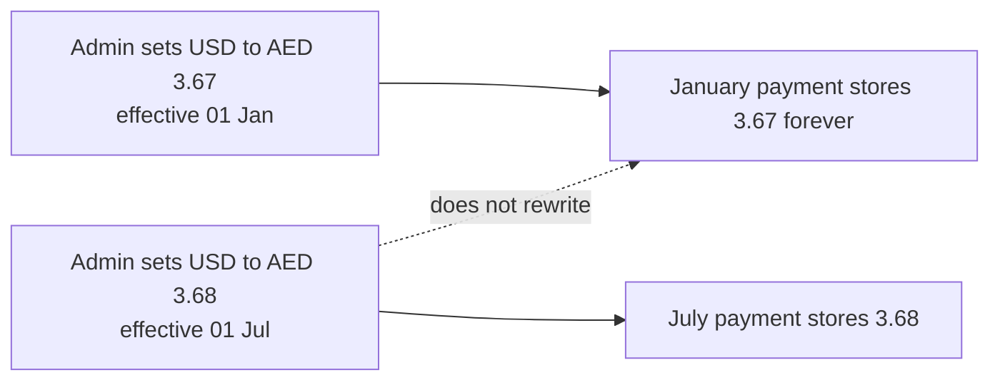

# Currency and Conversion

> [!abstract] Related
> [[Definitions]] · [[Payments]] · [[Invoices]] · [[Refunds Disputes Chargebacks]] · [[Dashboard and Reporting]] · [[Business Rules]] · [[00 Home]]

> [!danger] Locking rule
> Once a payment is Confirmed/Successful, the fixed conversion rate snapshot and financial amounts are **read-only**. Later Admin rate changes affect future conversions only. Corrections use a controlled adjustment/reversal, never an edit of the original transaction.

**Formulas**

- `converted_settlement_amount = invoice_amount_applied × fixed_conversion_rate`
- `invoice_outstanding = invoice_total − sum(confirmed payment applications in invoice currency)`
- Processor/merchant fee is **optional reconciliation only** and is excluded from both formulas

### 6.1 Default Currencies

| Code | Name | Typical Symbol | Initial Status |
| --- | --- | --- | --- |
| USD | US Dollar | $ | Active |
| AED | UAE Dirham | AED | Active |
| PKR | Pakistani Rupee | PKR / Rs | Active |
| GBP | Pound Sterling | £ | Active |
| AUD | Australian Dollar | A$ | Active |

TASK-014 seeds these five ACTIVE rows in `currencies`. Admin may add further ISO-style currencies and soft-disable existing ones.

TASK-015 stores per-company enablement in `company_currencies` (enabled subset + one default invoice currency when any are enabled). Only globally ACTIVE currencies may be newly enabled.

TASK-016 stores Admin-defined rows in `fixed_conversion_rates` (`NUMERIC(20, 12)`). Create is append-only; market/gateway rates are never fetched or substituted.

TASK-017 expires prior ACTIVE versions for the same pair when a new version is created (rows retained; `fixed_rate` unchanged). Version history is listed under Settings.

TASK-018 selects the effective Admin fixed rate for a pair at timestamp `at` via `resolveFixedConversionRate` / `selectEffectiveRate` (`validFrom <= at < validTo`; same-currency → `1.000000000000`; missing → Admin configuration error; never market FX). Payment/settlement application remains later.

TASK-019 provides centralized Prisma Decimal helpers in `src/domain/money`: `computeConvertedSettlementAmount` (fee excluded), rounding to currency precision, settings tolerance, outstanding from confirmed applications, and display-only formatting. TASK-052 adds Decimal-based `toMinorUnits` / `toProviderAmountInteger` for provider API boundaries (Stripe Checkout); adapters must not recompute Admin fixed rates or use JavaScript float money math.

TASK-020 stores per-company, per-payment-method settlement currency enablement on `payment_gateway_configs` / `payment_gateway_settlement_currencies` (method enablement + currency codes; no credentials). Initial USD/AED (BR-007); Admin may enable other ACTIVE catalog codes. Non-enabled settlement currencies are rejected (BR-006). Encrypted credentials remain TASK-049; live charges remain later.

TASK-021 formalizes disable vs historical visibility: soft status flags only; `assertCurrencySelectableForNewDocument` / `validateCurrencyForNewDocument` reject disabled currencies for new invoice/payment selection; `currenciesForNewDocumentPicker` / `NewDocumentCurrencyPicker` hide INACTIVE codes; `resolveCurrencyForHistoricalDisplay` keeps disabled catalog metadata visible without rewriting stored codes (BR-011).

### 6.2 Currency Administration

- Admin can add a new ISO-style currency record with code, name, symbol, decimal precision, and status.

- Admin can disable a currency. Disabled currencies remain visible on historical records but cannot be selected for new invoices/payments.

- A company can enable a subset of globally active currencies.

- Settlement currencies are configured separately per payment method (TASK-020). Initially payment settlement must support USD and AED only unless expanded by Admin configuration.

### 6.3 Fixed Conversion Rates

The application must use Admin-defined fixed conversion rates only. No live/automatic FX provider, gateway exchange rate, or market-rate lookup is required in Version 1. Rates are maintained centrally by Admin and applied whenever invoice currency differs from the selected settlement currency.

| Field | Stored On Payment | Notes |
| --- | --- | --- |
| invoice_currency | Yes | Original billed currency. |
| invoice_amount_applied | Yes | Amount of invoice currency covered by this payment. |
| settlement_currency | Yes | USD/AED initially. |
| fixed_conversion_rate | Yes | Exact Admin-defined fixed rate snapshot used for this payment. |
| rate_source | Yes | Admin Fixed Rate. |
| rate_effective_at | Yes | Effective timestamp/version of the configured fixed rate used. Same-currency payments store the payment date. |
| converted_settlement_amount | Yes | invoice_amount_applied x fixed_conversion_rate. Merchant fee excluded. |
| processor_fee | Optional | Optional reconciliation field in settlement currency; never used in conversion or invoice-balance math. |
| actual_received_amount | Optional | Amount actually recorded/confirmed as received, if the business wants to track it separately. |
| base_currency_equivalent | Recommended | For consolidated reporting using stored fixed reporting-rate snapshots. |

TASK-046 persists these snapshot columns on `payments` and locks them when status becomes SUCCESSFUL. Create/confirm resolve only Admin fixed rates via [[TASK-018 Effective Rate Selection]] and convert with [[TASK-019 Money Calculation Utilities]] (Prisma Decimal; fee excluded). Confirm never re-resolves a stored snapshot, so a later Admin rate version cannot rewrite historical payments (BR-021). Market or gateway FX is never fetched or substituted.

TASK-047 treats `processor_fee` / `actual_received_amount` as store-only reconciliation fields. Actual received is never computed as converted settlement minus fee. Outstanding continues to use invoice-currency applications only; fees never enter that formula.

- Admin can create or update a fixed rate for a currency pair (for example GBP -> USD or AUD -> AED). A rate change applies only to future payment/conversion records; historical payment records keep the exact fixed-rate snapshot originally used.

### 6.4 Rate Versioning, Effective Dates, and Frequency

Fixed rates must be versioned. Admin never edits the historical rate used by an existing payment; a new rate version is created whenever the business changes its fixed conversion rate.

- Admin fields: From Currency, To Currency, Fixed Rate, Effective From, Effective To (optional), Frequency/Label (Monthly / Yearly / Manual), Status, Notes, Created By, and Created At.

- A rate may start immediately or be scheduled for a future date/time. Rate changes are prospective only and do not recalculate old payments.

- When a new version becomes active for the same pair, the previous version is expired/closed but retained permanently.

- Every cross-currency payment stores rate_version_id plus fixed_rate_snapshot. Historical reports use the payment snapshot, not the currently active rate.

- Example: USD -> AED = 3.67 from 01-Jan-2026. Admin changes it to 3.68 effective 01-Jul-2026. A January payment remains 3.67 forever; a new July payment uses 3.68.

- If a rate is changed mid-month, only new transactions at/after the activation time use the new rate. Earlier transactions in that month remain unchanged.

| Pair | Rate | Frequency | Effective From | Effective To | Status | Applies To |
| --- | --- | --- | --- | --- | --- | --- |
| USD -> AED | 3.670000 | Yearly | 01-Jan-2026 | 01-Jul-2026 | Expired | Historical transactions |
| USD -> AED | 3.680000 | Monthly/Manual | 01-Jul-2026 |  | Active | New transactions |

### 6.5 Conversion Formula

| converted_settlement_amount = invoice_amount_applied x fixed_conversion_rate invoice_outstanding = invoice_total - sum(confirmed payment applications in invoice currency) processor_fee = optional reconciliation field only; excluded from both formulas |
| --- |

The system calculates the converted settlement amount using the fixed Admin rate stored for the selected currency pair. If invoice and settlement currencies are the same, the conversion rate is 1.000000.

> [!danger] Locking rule
> Locking rule Once a payment reaches Confirmed/Successful status, the fixed conversion rate snapshot and financial amounts used for that payment must be read-only. Later Admin rate changes affect future conversions only. Corrections must use a controlled adjustment/reversal record, not editing of the original transaction.

Merchant/processor fees are separate optional reconciliation data. They must never be included in the currency-conversion formula, must never change the converted settlement amount, and must never change the invoice balance.

## Related Documentation

### Depends On

- [[Definitions]]
- [[Companies and Brands]]

### Integrates With

- [[Payments]]
- [[Invoices]]
- [[Refunds Disputes Chargebacks]]
- [[Dashboard and Reporting]]

### Technical

- [[Business Rules]]
- [[Data Model]]
- [[Testing]]

> [!danger] Fixed conversion rates
> Rates are Admin-defined and versioned. Historical payments retain the exact rate snapshot used. Changing a rate affects future transactions only. Never fetch, guess, or substitute a market/gateway rate.
> Also see [[Currency and Conversion]] · [[Payments]] · [[Business Rules]] · [[Data Model]] · [[Dashboard and Reporting]] · [[Testing]]

> [!tip] Merchant fees
> Merchant/processor fees are reconciliation data only. They must never change invoice balance, the fixed conversion rate, converted settlement amount, or invoice amount.
> Also see [[Payments]] · [[Currency and Conversion]] · [[Dashboard and Reporting]] · [[Business Rules]] · [[Testing]]

> [!danger] Financial immutability
> Confirmed financial transactions must preserve historical values. Corrections use adjustment/reversal workflows rather than silently editing historical records.
> Also see [[Invoices]] · [[Payments]] · [[Refunds Disputes Chargebacks]] · [[Currency and Conversion]] · [[Business Rules]] · [[Audit Logs]] · [[Testing]]
