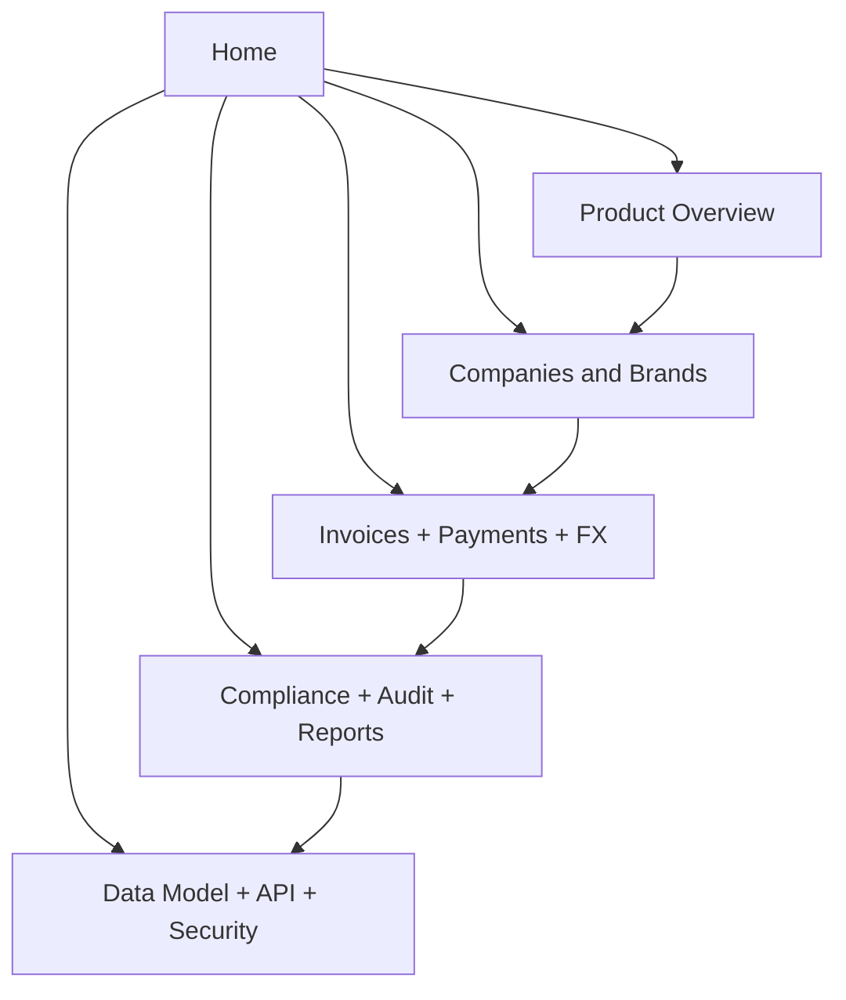
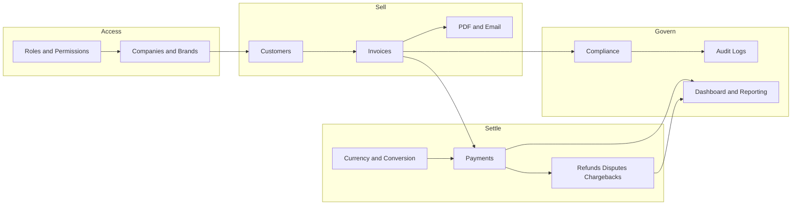

# Original Home

> [!note] Source / reference
> This is the original vault home from the source specification split. It is **not** the active development dashboard.
> Use [[00 Home]] and [[01 Master Spec]] for implementation control.

# Original Home (source)

Internal web platform for **multi-brand invoicing and payment management**. One master app, isolated companies, immutable financial history.

> [!danger] Immutable money
> Original invoice amount, fixed conversion-rate snapshot, converted settlement, payment, merchant fee, actual received, refunds, disputes, and chargebacks are **independent records**. Rate changes never rewrite history.

## Start here

| Open | What it is |
| --- | --- |
| [[Architecture]] | Visual canvas map of every module |
| Graph view | Ribbon icon **Open graph view** — colored by tag |
| [[multi_brand_invoice_saas_development_spec]] | Full spec hub with the same links |

## Product

- [[Product Overview]] — outcomes, feature map, modules
- [[Product Goals]] — in scope / out of scope
- [[Definitions]] — invoice currency, settlement, CB/RF, outstanding

## Modules

- [[Roles and Permissions]]
- [[Companies and Brands]]
- [[Currency and Conversion]]
- [[Customers]]
- [[Invoices]]
- [[PDF and Email]]
- [[Payments]]
- [[Refunds Disputes Chargebacks]]
- [[Compliance]]
- [[Audit Logs]]
- [[Dashboard and Reporting]]
- [[Notifications]]
- [[Settings]]
- [[Screen Inventory]]

## Technical

- [[Data Model]]
- [[API and Integrations]]
- [[Business Rules]]
- [[Security]]
- [[Error Handling]]
- [[Testing]]
- [[Deployment]]

## How to use this vault

1. Click **Open graph view** in the left ribbon.
2. Color groups are already set: product, module, finance, security, technical, qa.
3. Open [[Architecture]] for a board layout of the same notes.
4. Hover a `[[wikilink]]` to preview; right sidebar shows backlinks.

#invoice-saas #obsidian
