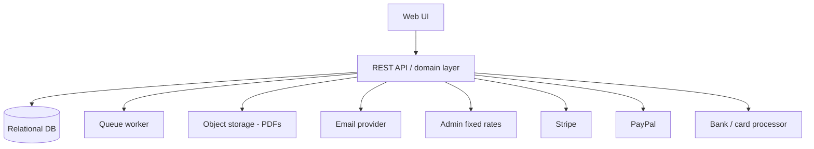
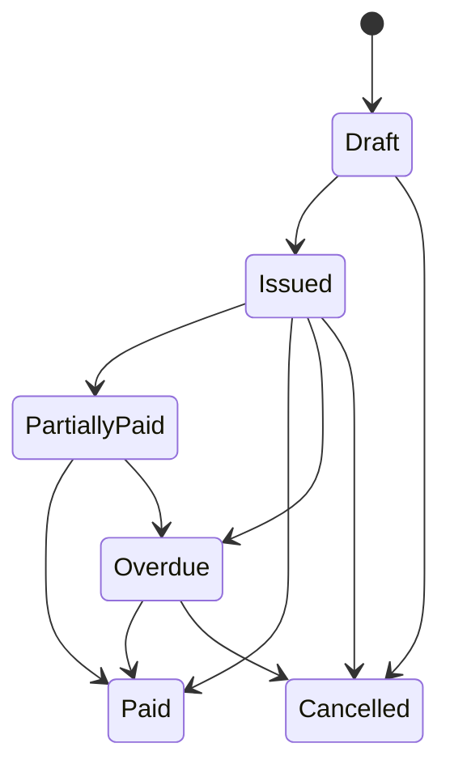

> [!note] Source / reference
> Historical specification hub. Authoritative implementation routing is [[01 Master Spec]]. Active dashboard is [[00 Home]].

# Multi-Brand Invoice Management SaaS — Development Specification

| Field | Value |
| --- | --- |
| Document type | Product requirements + technical specification |
| Version | 1.2 |
| Date | 13 August 2026 |
| Target | Version 1 / MVP |
| Vault home | [[00 Home]] |
| Canvas | [[Architecture]] |

> [!important] Core financial principle
> Financial history is immutable. The original invoice amount/currency, fixed conversion-rate snapshot, converted settlement amount, payment record, merchant fee, actual amount received, refunds, disputes, and chargebacks must be preserved as independent records. Later rate or configuration changes must never silently recalculate historical transactions.

This vault is the same specification, split into linked notes so Obsidian **graph**, **backlinks**, and **canvas** work. Everything lives in this folder.

## System map

## Table of contents

1. [[Product Overview]] — executive summary and feature map
2. [[Product Goals]] — in-scope modules and Version 1 exclusions
3. [[Definitions]] — currency, settlement, fees, outstanding
4. [[Roles and Permissions]] — Admin / Compliance / Staff RBAC
5. [[Companies and Brands]] — tenant isolation and reporting groups
6. [[Currency and Conversion]] — fixed rates, versioning, lock rule
7. [[Customers]] — master records across brands
8. [[Invoices]] — lifecycle, lines, issue/send/cancel
9. [[PDF and Email]] — branded PDFs and delivery logs
10. [[Payments]] — Stripe, PayPal, bank, manual, webhooks
11. [[Refunds Disputes Chargebacks]] — CB/RF and immutable originals
12. [[Compliance]] — review queue, approve/flag
13. [[Audit Logs]] — append-only history
14. [[Dashboard and Reporting]] — KPIs, monthly brand matrix
15. [[Notifications]] — email rules and merge fields
16. [[Settings]] — admin configuration
17. [[Screen Inventory]] — UI map
18. [[Data Model]] — entities and money storage
19. [[API and Integrations]] — REST, webhooks, adapters
20. [[Business Rules]] — BR-001 to BR-026
21. [[Security]] — authn, encryption, performance
22. [[Error Handling]] — missing rates, duplicate webhooks
23. [[Testing]] — layers and E2E-01..17
24. [[Deployment]] — environments, backup, architecture

## Invoice lifecycle

## Out of scope for Version 1

- Customer login portal
- General ledger / double-entry
- Expenses, inventory, payroll, purchase orders
- Tax filing
- Native mobile apps

See [[Product Goals]] for the full list.

## Graph tags

| Tag | Color group | Notes |
| --- | --- | --- |
| `#product` | amber | Overview, goals, rules |
| `#module` | blue | Product modules |
| `#finance` | green | Money, FX, reports |
| `#security` | red | RBAC, audit, compliance |
| `#technical` | purple | Data, API, deploy |
| `#qa` | teal | Testing |

Open **Graph view** from the left ribbon. Local graph on any note shows only its neighbors.
