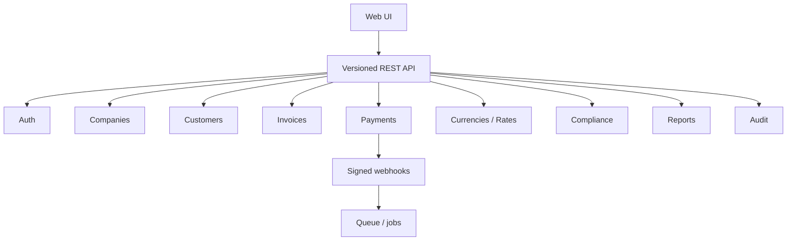

# API and Integrations

> [!important] Accepted HTTP boundary
> Next.js Route Handlers / Server Actions coordinate use cases. They must not contain core domain logic. Identity is Supabase Auth; authorization is application-owned. Payment providers are resolved through the registry in [[05 Architecture Decisions#ADR-008 — Payment provider architecture|ADR-008]] (`verifyWebhook()` is part of the provider contract; implemented in [[TASK-048 Payment Provider Abstraction]]).
> See [[02 Architecture]] and [[05 Architecture Decisions#ADR-020 — Next.js server layer|ADR-020]].

> [!abstract] Related
> [[Payments]] · [[Data Model]] · [[Security]] · [[Error Handling]] · [[Deployment]] · [[00 Home]]

The frontend should consume a versioned backend API. Even if the application is server-rendered, business logic should remain in reusable service/domain layers. Suggested endpoint groups are below; exact URLs may vary.

| API Group | Representative Operations |
| --- | --- |
| Auth | POST /api/auth/login, POST /api/auth/logout, POST /api/auth/forgot-password, POST /api/auth/reset-password; GET /auth/callback for Supabase recovery. GET /api/roles requires `user.manage` (TASK-005). optional MFA challenge endpoints later. |
| Companies | GET/POST /api/companies; GET/PATCH /api/companies/{id}. List/create/PATCH require `company.write`. GET by id requires company access (TASK-008). Branding subresource: GET/PATCH /api/companies/{id}/branding; GET/POST/DELETE /api/companies/{id}/branding/logo (TASK-010, `company.write`). Company currencies: GET/PATCH /api/companies/{id}/currencies (TASK-015, `company.write`; reject enabling globally inactive currencies; historically enabled inactive assignments preserved for visibility). Settlement currencies: GET /api/companies/{id}/settlement; PATCH /api/companies/{id}/settlement/{methodCode} (TASK-020, `gateway.credentials.manage`; reject non-enabled settlement currency; no credentials/charges). Gateway configuration: GET /api/companies/{id}/gateways; PATCH /api/companies/{id}/gateways/{methodCode}; PUT /api/companies/{id}/gateways/{methodCode}/credentials (TASK-049, `gateway.credentials.manage`; ADR-022 envelope; safe metadata only — never plaintext/ciphertext/DEK/nonce/tag). Reporting groups: GET/POST /api/reporting-groups; GET/PATCH /api/reporting-groups/{id} (TASK-011, `company.write`; membership is not authorization). System settings: GET/PATCH /api/system-settings (TASK-013, `settings.manage`). Currencies: GET/POST /api/currencies; GET/PATCH /api/currencies/{id} (TASK-014, `currency.manage`; soft-disable). New-document selection validation is domain/service-only (`validateCurrencyForNewDocument` / `listCurrenciesForNewDocument`, TASK-021) for later invoice/payment callers — not a public picker API. Fixed conversion rates: GET/POST /api/fixed-conversion-rates (TASK-016/017, `currency.manage`; append-only versions; expire prior ACTIVE on create; no live FX; no historical rate PATCH). Effective selection is domain/service-only (`resolveFixedConversionRate`, TASK-018) for later conversion callers — not a public FX endpoint. |
| Company context | GET/POST /api/company-context (TASK-009 switcher selection). POST /api/company-context/transactional rejects All Companies and cross-company IDOR for company-scoped transactional checks. |
| Customers | GET/POST /api/customers (list/search `q`/`status`/`companyId`, create with `companyIds`; optional `acknowledgeDuplicates`); GET/PATCH /api/customers/{id}; POST /api/customers/{id}/status (soft ACTIVE/INACTIVE); GET/PUT/POST/DELETE /api/customers/{id}/companies; GET /api/customers/{id}/profile; GET /api/customers/{id}/financial-summary; GET /api/customers/{id}/invoices (placeholder); GET /api/customers/{id}/payments (placeholder); GET/POST /api/customers/{id}/notes (internal-only). TASK-023+025+026+027+028+029: `customer.create` / `customer.edit` / `customer.delete` (Admin soft-deactivate only). Create/update may return `409` + `CUSTOMER_DUPLICATE_WARNING` + `duplicates[]` (Admin/Compliance may proceed with ack). Financial summary is by invoice currency (BR-013); live amounts wire when invoice/payment sources exist. Access via `customer_companies`. |
| Invoices | GET/POST /api/invoices; GET/PATCH /api/invoices/{id} (TASK-031 drafts); GET/PUT /api/invoices/{id}/items (TASK-033); POST /api/invoices/{id}/issue; POST /api/invoices/{id}/cancel; POST /api/invoices/{id}/duplicate (TASK-043); GET/POST /api/invoices/{id}/versions; GET/POST /api/invoices/{id}/pdf (TASK-039 generate/list metadata); GET /api/invoices/{id}/pdf/files/{fileId} (TASK-040 preview/download stream; TASK-043 print uses same); GET/POST /api/invoices/{id}/email (TASK-041 send + email_logs; TASK-042 UI + optional cc/bcc). |
| Payments | GET/POST /api/payments; GET /api/payments/{id}; POST /api/payments/{id}/confirm; POST /api/payments/{id}/fail (TASK-045); POST /api/payments/manual (TASK-050); POST /api/payments/{id}/dispute (TASK-063, `payment.adjust`; linked DISPUTE OPEN/UNDER_REVIEW adjustment; original SUCCESSFUL unchanged); POST /api/payments/{id}/refund (TASK-064, `payment.adjust`; linked REFUND PROCESSED full refund; BR-025 settlement snapshot/actual; optional `adapter.refundPayment` when supported; original SUCCESSFUL unchanged). Create pending derives company/customer from the invoice, resolves Admin fixed rate, stores converted settlement with fee excluded. Manual record forces MANUAL method/source, create→confirm SUCCESSFUL, optional human reference only (no fabricated gateway IDs), optional fee/actual received reconciliation-only; does not mutate invoice paid/outstanding. Confirm/fail are status-only and do not rewrite fee fields. GET is company-scoped (Staff assigned + invoice visibility); unauthorized company access → 403. TASK-051 Manual Payment UI and TASK-061 list / TASK-062 detail use server actions wrapping list/get (no new payment HTTP routes for UI). Partial refund / chargeback adjustment endpoints remain later Phase 06. |
| Gateways | Create checkout/payment request; provider status; webhook endpoints for Stripe/PayPal (bank processor live webhook **DEFERRED** with TASK-056/057). TASK-058: `GET /api/payments/checkout-options?invoiceId=`, `POST /api/payments/checkout` (PENDING + Admin rate snapshot + provider checkout URL; `invoice.create`; no Paid confirmation). TASK-053: `POST /api/webhooks/stripe/{companyId}`. TASK-055: `POST /api/webhooks/paypal/{companyId}` (signature auth; idempotent `payment_events`; confirm/fail existing PENDING only; no payment create). |
| Currencies | GET/POST/PATCH currencies; fixed-rates endpoint; company-enabled currency endpoint. |
| Compliance | Queues, review detail, status update, notes. |
| Reports | Parameterized report endpoints with pagination and export jobs/files. |
| Audit | Append-only application writes via domain/service (TASK-012). Read-only filter endpoint for authorized roles remains TASK-076. No update/delete audit APIs. |
| Users | GET/POST /api/users; GET/PATCH /api/users/{id}; POST /api/users/{id}/suspend; POST /api/users/{id}/reset-password (TASK-006, Admin/`user.manage` only). PATCH/create persist `companyIds` (TASK-008). |

### 18.1 Webhook Requirements

- Dedicated webhook URL per provider or provider type.

- Validate webhook signatures using provider secrets.

- Store external event IDs and enforce unique processing for idempotency.

- Respond quickly; move heavy post-processing to queue/jobs if architecture supports it.

- Log processing result and correlation ID without logging sensitive secrets/card data.

- Support event retries safely.

### 18.2 Payment Provider Adapter Interface

| createPaymentRequest(invoice, settlementCurrency, convertedAmount) getPaymentStatus(externalTransactionId) parseWebhook(payload, headers) getFees(transaction)  # optional reconciliation only refundPayment(transaction, amount)  # if supported healthCheck() |
| --- |

Accepted architecture also requires `verifyWebhook()`, a provider registry, and capability flags. TASK-048 implements the TypeScript `PaymentProvider` contract, `PaymentProviderRegistry`, capability flags, and Manual + Fake adapters. TASK-052 registers the live `StripePaymentAdapter` (Checkout Session create/status + webhook signature verify). TASK-053 completes Stripe `parseWebhook` plus `POST /api/webhooks/stripe/{companyId}` with `payment_events` idempotency. TASK-054 registers the live `PayPalPaymentAdapter` (Orders create/status + webhook signature verify). TASK-055 completes PayPal `parseWebhook` plus `POST /api/webhooks/paypal/{companyId}` with `payment_events` idempotency. Live `BANK_PROCESSOR` adapter/webhook remain **DEFERRED** (TASK-056/057) until a concrete vendor/API is selected — do not invent a fictional bank API. Do not hardcode provider names in core domain logic. See [[05 Architecture Decisions#ADR-008 — Payment provider architecture|ADR-008]].

Company gateway credentials are encrypted at rest per [[05 Architecture Decisions#ADR-022 — Gateway credential encryption|ADR-022]]. TASK-049 implements storage on `payment_gateway_configs`. Normal configuration APIs must never return plaintext credentials, ciphertext, wrapped DEKs, nonces, auth tags, or keys — only safe metadata such as `credentialsConfigured`. Decrypt only through the server-only credential service. Stripe and PayPal adapters resolve credentials via `createGatewayCredentialResolver` → `GatewayCredentialService` (never global env keys for company charges).

## Related Documentation

### Depends On

- [[Security]]
- [[Data Model]]

### Integrates With

- [[Payments]]
- [[Error Handling]]
- [[Deployment]]

### Technical

- [[Testing]]
- [[02 Architecture]]

> [!warning] Company isolation
> Every company-scoped operation must enforce company access **server-side**. Frontend hiding is not authorization.
> Also see [[Roles and Permissions]] · [[Companies and Brands]] · [[Business Rules]] · [[Security]] · [[Data Model]] · [[API and Integrations]] · [[Testing]]
