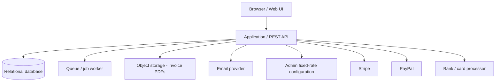

# Deployment

> [!important] Accepted runtime architecture
> Authoritative stack: Docker + Linux VPS + Caddy, Next.js, managed Supabase PostgreSQL (not on the app VPS), BullMQ/Redis worker, Cloudflare R2, Resend. Exact VPS vendor remains open.
> See [[02 Architecture]] and [[05 Architecture Decisions#ADR-017 — Deployment|ADR-017]]. The original environment list below remains valid.

> [!abstract] Related
> [[API and Integrations]] · [[Security]] · [[PDF and Email]] · [[Product Goals]] · [[00 Home]]

### 23.1 Recommended Environments

| Environment | Purpose |
| --- | --- |
| Local | Developer workstation. |
| Development | Shared development integration environment. |
| Staging/UAT | Production-like environment for business acceptance and gateway sandbox tests. |
| Production | Live system using live payment credentials and protected data. |

### 23.2 Recommended Technical Architecture

The requirements originally described an implementation-agnostic reference architecture. **Accepted** runtime choices are in [[05 Architecture Decisions]] (Next.js, not Laravel). A Laravel-based backend is no longer the selected stack.

| Browser / Web UI       | Application / REST API       +-- Relational Database       +-- Queue / Job Worker       +-- Object Storage (invoice PDFs)       +-- Email Provider       +-- Admin Fixed-Rate Configuration       +-- Stripe / PayPal / Bank Processor APIs + Webhooks |
| --- |

### 23.3 Backup / Recovery

- Automated database backups at least daily; more frequent/point-in-time recovery preferred.

- Invoice PDF/object storage backups or versioning.

- Documented restore procedure tested periodically.

- Separate backup retention from primary production account where practical.

- Secrets backed up using secure secret-management procedures, not plaintext files.

## Related Documentation

### Depends On

- [[02 Architecture]]

### Integrates With

- [[API and Integrations]]
- [[Security]]
- [[PDF and Email]]

### Technical

- [[Product Goals]]
- [[05 Architecture Decisions]]
