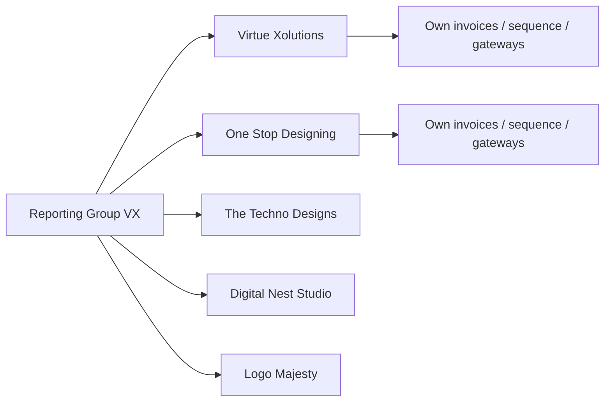

# Companies and Brands

> [!abstract] Related
> [[Roles and Permissions]] · [[Customers]] · [[Invoices]] · [[Currency and Conversion]] · [[Dashboard and Reporting]] · [[Settings]] · [[Data Model]] · [[00 Home]]

> [!warning] Tenant isolation
> Every transactional table must include `company_id` directly or through an enforced relationship. Backend authorization must verify company access on **every** request. Hiding records in the UI is not sufficient.

### 5.1 Company Record

| Field | Requirement |
| --- | --- |
| Company ID | System-generated unique ID. |
| Display Name | Brand-facing name used on invoices. |
| Legal Name | Registered/legal entity name, optional if different. |
| Logo | Uploaded company logo used on invoice PDF. |
| Business Address | Structured address fields. |
| Country | ISO country selection. |
| Email / Phone / Website | Brand contact details. |
| Registration / Tax Number | Optional company identifier. |
| Default Invoice Currency | One active currency. TASK-015: `company_currencies.is_default` among enabled rows. |
| Enabled Invoice Currencies | Any subset of active currencies. TASK-015: `company_currencies` with `enabled=true`. |
| Reporting Currency | Typically USD; may be inherited from master settings. |
| Invoice Prefix | Unique or company-specific prefix such as VX-. |
| Invoice Sequence | Independent number sequence per company. |
| Terms & Conditions | Brand-specific default invoice terms. |
| Email Template | Brand-specific invoice email template. |
| Payment Modes | Each payment mode individually enabled/disabled. TASK-020: `payment_gateway_configs.enabled` per method. |
| Gateway Credentials | Stored encrypted and isolated to company. TASK-049 (not yet). |
| Settlement Currencies | Per method/company enablement. TASK-020: `payment_gateway_settlement_currencies` (USD/AED initial; Admin may expand ACTIVE catalog codes). |
| Status | Active / Inactive. |

### 5.2 Company Switcher

- Header-level company selector for authorized users.

- Admin option: All Companies for consolidated reporting only; transactional actions must always select one concrete company.

- Compliance sees only assigned companies.

- Staff sees only assigned companies.

- Changing company context must refresh available customers, currencies, invoice prefix, templates, payment modes, and reports.

> [!warning] Tenant isolation
> Tenant isolation Every transactional table must include company_id directly or through an enforced relationship. Backend authorization must verify company access on every request; hiding records in the UI is not sufficient.

### 5.3 Reporting Group / Parent Company

To reproduce consolidated reports such as the supplied VX example, each company/brand may optionally belong to a Reporting Group (parent business group). The group is for roll-up reporting and does not weaken company-level access controls.

- Example: Reporting Group "VX" may contain Virtue Xolutions, One Stop Designing - VX, The Techno Designs, Digital Nest Studio - VX, and Logo Majesty.

- Reports must support one Reporting Group, multiple groups, a single brand/company, or All Companies.

- Historical transaction ownership always remains the original company/brand.

## Related Documentation

### Depends On

- [[Roles and Permissions]]

### Integrates With

- [[Customers]]
- [[Invoices]]
- [[Currency and Conversion]]
- [[Dashboard and Reporting]]
- [[Settings]]

### Technical

- [[Data Model]]
- [[Security]]
- [[Business Rules]]
- [[API and Integrations]]
- [[Testing]]

> [!warning] Company isolation
> Every company-scoped operation must enforce company access **server-side**. Frontend hiding is not authorization.
> Also see [[Roles and Permissions]] · [[Companies and Brands]] · [[Business Rules]] · [[Security]] · [[Data Model]] · [[API and Integrations]] · [[Testing]]
