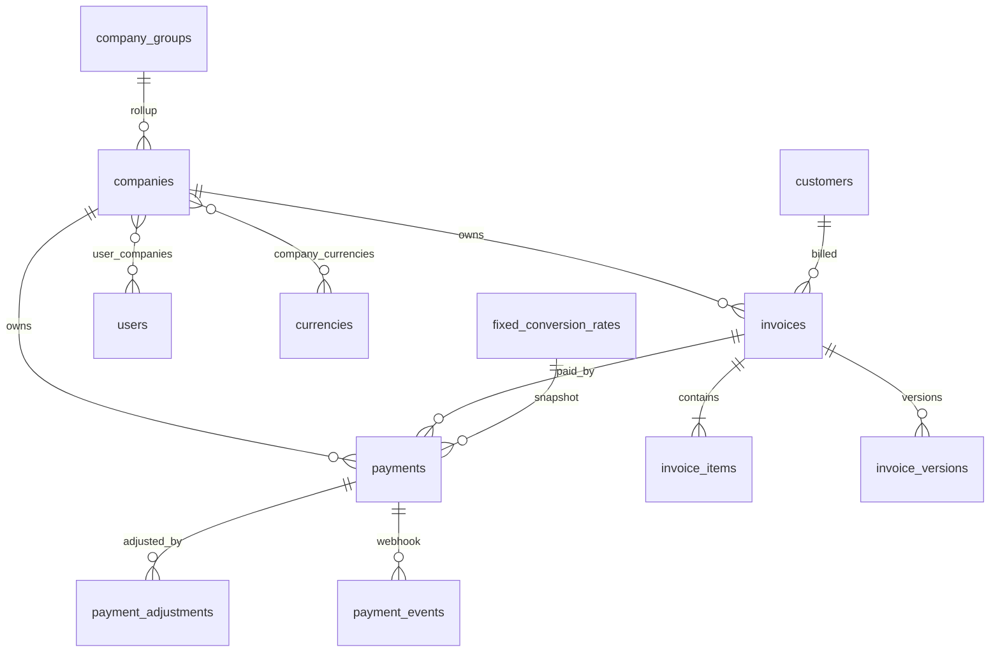

# Data Model

> [!abstract] Related
> [[Companies and Brands]] · [[Customers]] · [[Invoices]] · [[Payments]] · [[Refunds Disputes Chargebacks]] · [[Audit Logs]] · [[API and Integrations]] · [[00 Home]]

> [!note] Money storage
> Use Prisma Decimal mapped to PostgreSQL NUMERIC/DECIMAL — never JavaScript floating point for authoritative money. Store currency code with every monetary value. Conversion rates need 8–12 decimal places. Rounding is defined server-side; client totals are display-only. See [[05 Architecture Decisions#ADR-004 — Money representation|ADR-004]]. TASK-019 implements the shared helpers in `src/domain/money`.

> [!note] Users and identity
> Application `users` must store a stable link to the Supabase Auth user identifier. Login credentials are not an application-owned second password store. See [[05 Architecture Decisions#ADR-003 — Authentication|ADR-003]].

The exact schema may vary by framework, but the following logical entities and relationships are required. Use immutable identifiers (UUIDs recommended for externally referenced records) and consistent created_at/updated_at timestamps.

| Entity | Key Purpose / Fields |
| --- | --- |
| users | id, name, email, password_hash, role_id, status, last_login_at, mfa fields. |
| roles / permissions | role definitions and granular permission mapping. |
| user_companies | user_id, company_id; controls company access. |
| companies | identity, branding, address, default currency, invoice prefix, `invoice_sequence_next` (TASK-035), optional reporting_group_id / parent group, status. |
| currencies | code, name, symbol, decimals, active. |
| company_currencies | company_id, currency_id, enabled/default flags. |
| fixed_conversion_rates | from_currency, to_currency, fixed_rate, version_no, frequency_label, valid_from, valid_to, status, notes, created_by, created_at. Versions are append-only/prospective; expired versions are retained. |
| customers | master customer information and status. TASK-022 implements `customers` (Customers §7.1 fields; email optional; soft ACTIVE/INACTIVE). |
| customer_companies | TASK-025: optional multi-company linkage (`customer_id`, `company_id`). Authorization for Staff/Compliance uses intersection with `user_companies`. |
| invoices | TASK-030 header + TASK-034 stored totals + TASK-035 nullable until numbered (`invoice_number` unique per company). TASK-038 soft-cancel: `cancellation_reason`, `cancelled_at`, `cancelled_by_user_id` (no hard delete). |
| invoice_items | TASK-033: invoice_id, description, qty, unit rate, optional tax name/rate snapshot, server line_total. Discount omitted until ADR-010. |
| invoice_versions | TASK-037: invoice_id, version_no, JSON snapshot (header/lines/totals), reason, created_by; append-only on issue. |
| invoice_files | TASK-039: invoice_id + invoice_version_id (unique), storage_key, checksum_sha256, byte_size, content_type, page_size (A4/LETTER), created_at. Blob in StorageService — not Postgres. |
| payments | TASK-044 schema + TASK-046 snapshot: invoice/company/customer, method_code, status PENDING/SUCCESSFUL/FAILED, external_transaction_id, invoice currency applied, settlement currency, fixed conversion rate snapshot, `rate_source`, `rate_effective_at`, optional `rate_version_id`, converted settlement amount, optional merchant fee, optional actual received amount, dates, source, actors. Provider-agnostic (ADR-008); no credentials. |
| payment_events | gateway webhook/events, unique external event ID, raw normalized status metadata; sensitive payload handling required. |
| payment_adjustments | linked original payment; type (refund/dispute/chargeback/reversal), amount, invoice-currency amount if applicable, settlement-currency amount, status, reason, merchant reference/case ID, opened/processed/resolved dates, created_by. Original payment is never overwritten. |
| payment_gateway_configs | company, method code, enabled; settlement currencies via `payment_gateway_settlement_currencies`. Encrypted credentials, environment, webhooks later (TASK-049). |
| compliance_reviews | entity, status, reviewer, notes, reason code, timestamps. |
| customer_notes | TASK-027: internal-only notes (`customer_id`, `author_user_id`, `body`, `visibility=INTERNAL`, `created_at`). Never portal/PDF/email. |
| email_logs | invoice, recipient, subject, provider ID, status, sent_by, timestamps. |
| audit_logs | append-only event store fields defined earlier. |
| attachments | generic metadata for evidence/supporting docs if included. |
| system_settings | reporting currency, timezone defaults, policies; secrets should not be stored here unencrypted. |
| company_groups | Optional parent/reporting group for consolidated reporting (e.g., VX). Fields: id, name, code, status, display order. |

### 17.1 Key Relationships

| Company 1 -- * Invoices Company 1 -- * Payment Gateway Configurations Company * -- * Users (through user_companies) Customer 1 -- * Invoices Invoice 1 -- * Invoice Items Invoice 1 -- * Payments Invoice 1 -- * Invoice Versions / PDFs Payment 1 -- * Payment Events / Adjustments Customer * -- * Companies (optional linkage) User 1 -- * Audit Logs |
| --- |

### 17.2 Money Storage

- Use fixed-precision decimal types; never floating-point for money.

- Store currency code with every monetary value that is not unambiguously inherited.

- Use sufficient precision for fixed conversion rates (e.g., 8-12 decimal places) and 2+ decimals for currencies according to currency metadata.

- Define and document rounding rules server-side; client-side totals are display-only and must be revalidated by backend.

## Related Documentation

### Depends On

- [[Companies and Brands]]
- [[Currency and Conversion]]

### Integrates With

- [[Customers]]
- [[Invoices]]
- [[Payments]]
- [[Refunds Disputes Chargebacks]]
- [[Audit Logs]]

### Technical

- [[API and Integrations]]
- [[Security]]
- [[Testing]]

> [!warning] Company isolation
> Every company-scoped operation must enforce company access **server-side**. Frontend hiding is not authorization.
> Also see [[Roles and Permissions]] · [[Companies and Brands]] · [[Business Rules]] · [[Security]] · [[Data Model]] · [[API and Integrations]] · [[Testing]]

> [!danger] Fixed conversion rates
> Rates are Admin-defined and versioned. Historical payments retain the exact rate snapshot used. Changing a rate affects future transactions only. Never fetch, guess, or substitute a market/gateway rate.
> Also see [[Currency and Conversion]] · [[Payments]] · [[Business Rules]] · [[Data Model]] · [[Dashboard and Reporting]] · [[Testing]]
