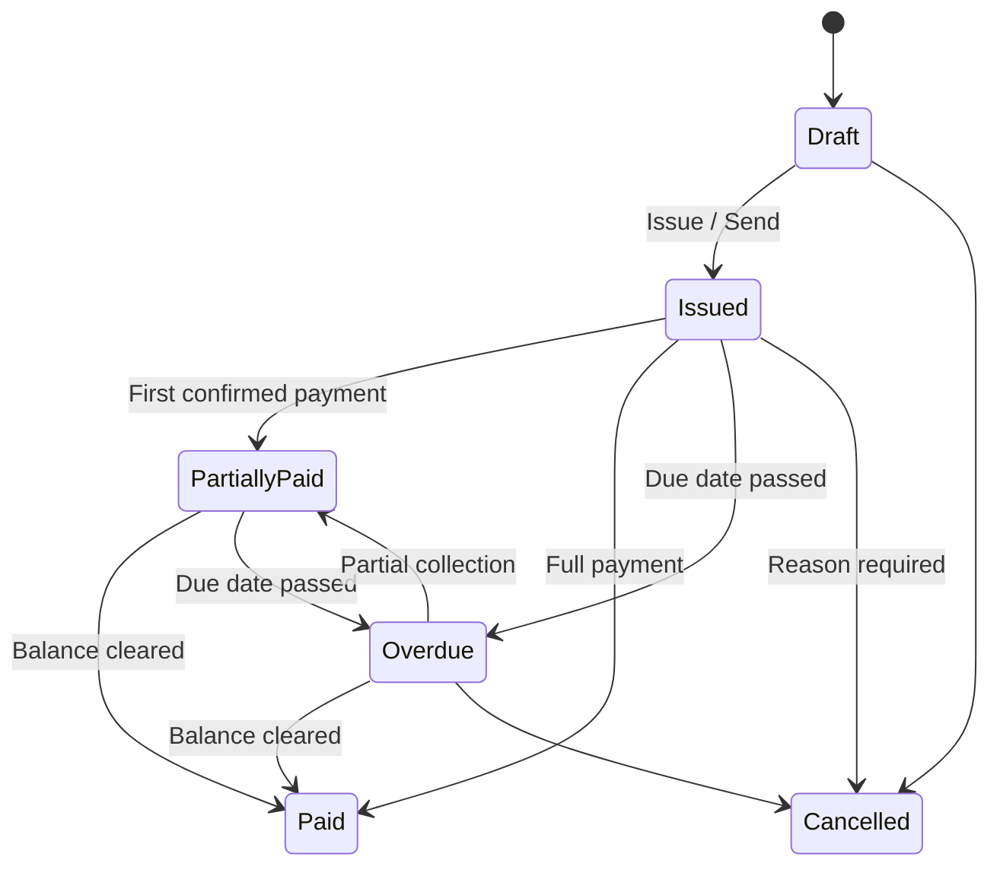

# Invoices

> [!abstract] Related
> [[Customers]] · [[Companies and Brands]] · [[PDF and Email]] · [[Payments]] · [[Currency and Conversion]] · [[Compliance]] · [[Business Rules]] · [[00 Home]]

### 8.1 Invoice Lifecycle

| From | To |
| --- | --- |
| Draft | Issued/Sent, Cancelled |
| Issued/Sent | Partially Paid, Paid, Overdue, Cancelled |
| Partially Paid | Paid, Overdue |
| Overdue | Partially Paid, Paid, Cancelled |

### 8.2 Invoice Header Fields

| Field | Requirement |
| --- | --- |
| Company | Mandatory; defines branding, numbering, currencies, payment modes. |
| Invoice Number | System-generated using company prefix/sequence; unique within company. |
| Customer | Mandatory. |
| Invoice Date | Mandatory. |
| Due Date | Mandatory unless company policy allows due-on-receipt. |
| Currency | Must be enabled for selected company. |
| Reference / PO | Optional. |
| Assigned Staff | Defaults to creator; editable by authorized roles. |
| Compliance Status | Not Reviewed / Under Review / Approved / Flagged. |
| Internal Notes | Never printed or emailed. |
| Customer Notes | Optional invoice-visible notes. |

### 8.3 Invoice Line Items

| Field | Type / Rule |
| --- | --- |
| Description | Text, required. |
| Quantity | Decimal > 0; default 1. |
| Unit Rate | Money in invoice currency. |
| Discount | Optional line or invoice level; percentage or fixed, implementation should choose one consistent model or support both explicitly. |
| Tax | Optional percentage; tax name/rate stored as snapshot. |
| Line Total | Calculated. |

### 8.4 Invoice Totals

- Subtotal

- Discount total

- Tax total

- Invoice total

- Confirmed paid amount in invoice currency

- Outstanding balance in invoice currency

### 8.5 Invoice Actions

| Action | Behavior |
| --- | --- |
| Save Draft | Editable financial fields; no customer communication. |
| Issue | Assign/finalize invoice number if numbering is delayed until issue; lock key fields according to policy. |
| Generate PDF | Generate immutable snapshot or versioned PDF. |
| Email Invoice | Attach PDF and optionally include hosted gateway payment link(s), without providing a customer portal. |
| Record Payment | Create payment against invoice; support partial payments. |
| Cancel Invoice | Status change with mandatory reason; history retained. |
| Duplicate | Create new Draft with copied line items and new invoice ID/number rules. |
| Export/Print | Download PDF / browser print. |

### 8.6 Editing Issued Invoices

Issued financial documents should not be silently altered. Recommended behavior: minor non-financial metadata may be edited with audit history; financial changes require either (a) a controlled revised invoice version with reason, or (b) cancellation and reissue. The final implementation decision should be consistent across all companies.

## Related Documentation

### Depends On

- [[Companies and Brands]]
- [[Customers]]
- [[Currency and Conversion]]
- [[Roles and Permissions]]
- [[Business Rules]]

### Integrates With

- [[PDF and Email]]
- [[Payments]]
- [[Compliance]]
- [[Audit Logs]]
- [[Dashboard and Reporting]]

### Technical

- [[Data Model]]
- [[API and Integrations]]
- [[Security]]
- [[Testing]]

> [!danger] Financial immutability
> Confirmed financial transactions must preserve historical values. Corrections use adjustment/reversal workflows rather than silently editing historical records.
> Also see [[Invoices]] · [[Payments]] · [[Refunds Disputes Chargebacks]] · [[Currency and Conversion]] · [[Business Rules]] · [[Audit Logs]] · [[Testing]]

> [!warning] Company isolation
> Every company-scoped operation must enforce company access **server-side**. Frontend hiding is not authorization.
> Also see [[Roles and Permissions]] · [[Companies and Brands]] · [[Business Rules]] · [[Security]] · [[Data Model]] · [[API and Integrations]] · [[Testing]]
