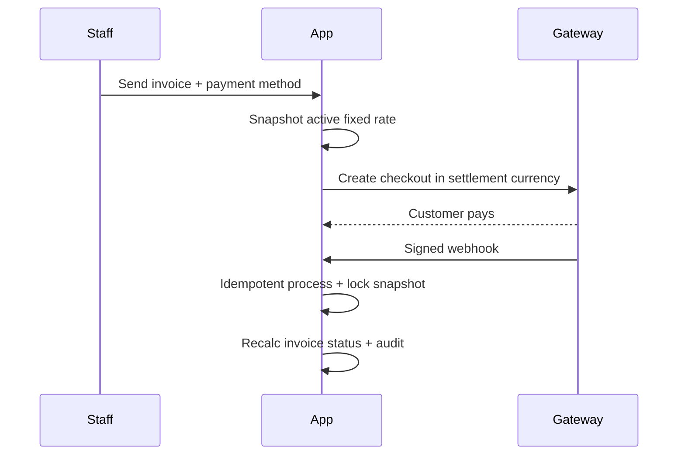

# Payments

> [!abstract] Related
> [[Invoices]] · [[Currency and Conversion]] · [[Refunds Disputes Chargebacks]] · [[API and Integrations]] · [[Error Handling]] · [[Business Rules]] · [[00 Home]]

> [!tip] Merchant fees
> Fees are optional reconciliation data. They never enter the conversion formula, never change converted settlement, and never change invoice balance.

### 10.1 Supported Payment Modes

| Mode | Initial Requirement |
| --- | --- |
| Stripe | Online/card processor integration. Company-specific credentials. Enable/disable per company. Settlement currency rules configurable. |
| PayPal | Company-specific integration. Enable/disable per company. Settlement currency rules configurable. |
| Bank/Card Processor | Provider **slot / configuration method code** (`BANK_PROCESSOR`) on company gateway config. Version 1 has **no live bank processor adapter**. Do not invent a fictional banking API. Exact vendor/API (Authorize.Net, Adyen, Checkout.com, Braintree, local acquirers, etc.) is selected later and added as an independent `PaymentProvider` adapter without redesigning the payment domain ([[TASK-056 Bank Processor Adapter]] / [[TASK-057 Bank Processor Webhook]] **DEFERRED**). |
| Manual Payment | Authorized user records payment received outside an automated gateway. |

### 10.2 Gateway Configuration Per Company

| Configuration | Requirement |
| --- | --- |
| Enabled | Boolean per gateway/company. TASK-020: `payment_gateway_configs.enabled` per method code. |
| Credentials | Encrypted at rest per [[05 Architecture Decisions#ADR-022 — Gateway credential encryption|ADR-022]] (AES-256-GCM envelope; env KEK keyring); never exposed to Staff. TASK-049 stores ciphertext + decrypt metadata on `payment_gateway_configs`. |
| Mode | Sandbox/Test vs Live. TASK-049: `payment_gateway_configs.environment`. |
| Settlement Currencies | USD and/or AED initially; Admin may expand ACTIVE catalog codes. TASK-020: `payment_gateway_settlement_currencies`. |
| Webhook Secret | Encrypted with the same ADR-022 envelope (inside credential payload); required where gateway supports webhooks. TASK-049. |
| Merchant Fee Capture | Optional API-provided or manual reconciliation field. Never used in fixed-rate conversion or invoice balance. |
| Payment Link / Checkout | Optional hosted checkout generation; no customer portal. |
| Status | Healthy / Configuration Error / Disabled (operational indicator). TASK-049 derives status from enablement + credentialsConfigured + environment (no decrypt on GET). |

### 10.3 Payment Record

| Field | Description |
| --- | --- |
| Payment ID | Unique internal identifier. |
| Company ID | Company owning the payment. |
| Invoice ID | Invoice being paid. |
| Customer ID | Snapshot/reference to customer. |
| Payment Method | Stripe / PayPal / Bank Processor / Manual. |
| Gateway Transaction ID | External transaction/reference ID. |
| Payment Status | Core status: Pending / Successful / Failed. Refund/dispute/chargeback state is derived from linked adjustment records and shown as lifecycle badges without deleting or rewriting the original payment. |
| Invoice Currency | Original invoice currency. |
| Invoice Amount Applied | Amount applied to invoice balance. |
| Settlement Currency | USD or AED initially. |
| Fixed Conversion Rate | Locked Admin-defined fixed rate snapshot used for conversion. |
| Rate Version ID | Snapshotted Admin fixed-rate version id; null when same-currency. |
| Rate Effective At | Effective timestamp of the Admin rate version used; payment date when same-currency. |
| Converted Settlement Amount | Invoice amount applied x fixed conversion rate; fee excluded. |
| Processor / Merchant Fee | Optional reconciliation field in settlement currency; excluded from conversion and invoice balance. |
| Actual Amount Received | Optional amount recorded/confirmed as actually received; not auto-derived from merchant fee. |
| Payment Date | Business/effective payment date. |
| Received At | System timestamp from webhook/API/manual confirmation. |
| Rate Source | Admin Fixed Rate, or Same Currency when invoice and settlement codes match. |
| Notes | Internal notes. |
| Created/Confirmed By | User or system/webhook actor. |

TASK-044 persists the provider-agnostic `payments` table (ADR-008): company + invoice + customer FKs; `method_code` (STRIPE/PAYPAL/BANK_PROCESSOR/MANUAL); external transaction reference; status PENDING/SUCCESSFUL/FAILED; invoice/settlement currency codes; invoice amount applied; locked fixed-rate snapshot + optional `rate_version_id`; converted settlement; optional processor fee and actual received (reconciliation only, BR-020); payment date / received_at; source; notes; created/confirmed actors. No gateway credentials, charges, webhooks, allocation, or payment UI. Confirmed financial fields are immutable in domain invariants (BR-004/005); adjustments are Phase 06.

TASK-045 adds the payment domain service and APIs on that schema: create PENDING, confirm (PENDING → SUCCESSFUL), fail (PENDING → FAILED), and GET list/detail. Each write follows authorization → company scope → invoice/customer validation → settlement enablement (BR-006) → Admin fixed-rate resolution (never market FX) → Decimal conversion (fee excluded, BR-020) → persistence → audit. Confirm/fail never rewrite financial columns. Staff cannot record/confirm (`payment.manual.record` denied). No gateway HTTP, allocation, or payment UI.

TASK-046 persists `rate_effective_at` and locks the conversion snapshot on confirm (BR-020 / BR-021): invoice/settlement currencies, applied amount, Admin fixed rate, `rate_source`, `rate_effective_at`, `rate_version_id`, converted settlement. Confirm does not re-resolve a stored snapshot, so a later Admin rate version cannot rewrite a historical payment. Same-currency payments store rate 1, `rate_source=SAME_CURRENCY`, `rate_effective_at=payment_date`, and null `rate_version_id`. Missing Admin rate blocks cross-currency create and incomplete-snapshot confirm. Processor fees remain a separate reconciliation field. Payment detail UI is later (TASK-062).

TASK-047 stores optional `processor_fee_amount` and `actual_received_amount` as reconciliation only (BR-020). Create accepts them from the API; actual received is never derived as converted settlement minus fee. Fees are excluded from conversion and outstanding. Confirm does not rewrite them. Payment detail UI is later (TASK-062).

TASK-048 adds the provider-agnostic `PaymentProvider` registry and capability flags (ADR-008). Application payment records stay normalized. Manual + Fake adapters exist for the contract; live Stripe/PayPal/bank SDKs are later. Domain code does not branch on vendor names. Credentials are not stored on payments (BR-008).

TASK-049 stores company gateway configuration on the existing TASK-020 `payment_gateway_configs` row (enabled, sandbox/live `environment`, non-secret `provider_config`, ADR-022 envelope-encrypted credentials including webhook secret). Normal APIs return safe metadata only (`credentialsConfigured`, status). Decrypt only through server-only `GatewayCredentialService` → `CredentialCipher` → `EnvironmentKeyProvider`. Settlement currencies remain TASK-020. No live charging or webhooks.

TASK-050 records manual payments on the same provider-neutral `payments` model via `recordManualPayment` / `POST /api/payments/manual`: forces `methodCode=MANUAL` + `source=MANUAL`; derives company/customer from the invoice; requires concrete company context; validates MANUAL settlement enablement (BR-006); resolves Admin fixed rate (same-currency rate 1); stores optional fee/actual received as reconciliation only (BR-020); rejects applied amount above open balance from SUCCESSFUL applications (BR-010) without inventing an overpayment allow workflow (US-015); creates PENDING then confirms SUCCESSFUL through the existing lifecycle (immutable snapshot); uses `ManualPaymentAdapter` without hosted checkout or fake webhooks; does not invent gateway transaction IDs; does not mutate invoice paid/outstanding (TASK-060). Staff remains denied (`payment.manual.record` / US-007 default deny).

TASK-051 adds Manual Payment UI on the design system: invoice detail **Record payment** dialog and standalone `/payments/manual` entry (concrete company context required). Forms call `recordManualPaymentAction` → TASK-050 `recordManualPayment` (no duplicated domain logic). Settlement currencies come from company MANUAL settlement config. Conversion preview is display-only; the server still locks the Admin fixed-rate snapshot on record. Fee/actual-received fields are labeled reconciliation-only. Success copy states invoice paid/outstanding are unchanged until allocation (TASK-060). Staff cannot see the nav item or submit (US-007). Gateway checkout UI remains later.

TASK-052 registers `StripePaymentAdapter` in the PaymentProvider registry (ADR-008). Capabilities: hosted checkout, payment status lookup, webhook signature verify, health check, multi settlement currencies. Unsupported/deferred (at 052): `parseWebhook` (TASK-053), refunds, fee retrieval, hosted checkout UI (TASK-058). Credentials resolve only through server-only `GatewayCredentialService` (company-isolated; sandbox/live env must match `sk_test_` / `sk_live_`). `createPaymentRequest` creates a Stripe Checkout Session using the domain-supplied **converted settlement amount** (Decimal → minor units); never Stripe FX; stable application idempotency key. Status maps to PENDING/SUCCESSFUL/FAILED. No Stripe columns on `payments`. Gateway settings UI shows Healthy / Configuration Error / Disabled and Stripe adapter-active copy.

TASK-053 implements Stripe webhook processing: `POST /api/webhooks/stripe/[companyId]` (company-scoped because webhook secrets are per-company / ADR-022). Signature verification uses the company webhook secret; path is public (no session RBAC). `parseWebhook` maps Checkout Session events to PENDING/SUCCESSFUL/FAILED. Events persist in `payment_events` with unique `(method_code, external_event_id)` for idempotency (E2E-10). Processing matches an existing payment by company + STRIPE + `externalTransactionId`, then confirms/fails via `applyGatewayWebhookPaymentStatus` (actor `WEBHOOK`; no financial field rewrites; no invoice balance mutation). Orphan events (no PENDING payment yet) are stored as `IGNORED` and return 200 — webhooks do not create payments (TASK-058). Inline job dispatcher is used (BullMQ worker remains TASK-099).

TASK-054 registers `PayPalPaymentAdapter` in the PaymentProvider registry (ADR-008). Capabilities: hosted checkout, payment status lookup, webhook signature verify, health check, multi settlement currencies. Unsupported/deferred (at 054): `parseWebhook` (TASK-055), refunds, fee retrieval, capture/hosted checkout UI (TASK-058). Credentials resolve only through server-only `GatewayCredentialService` (company-isolated; sandbox/live selects PayPal API host). `createPaymentRequest` creates a PayPal Orders v2 order using the domain-supplied **converted settlement amount** (Decimal → precision-aligned amount string); never PayPal FX; stable application `PayPal-Request-Id`. Status maps to PENDING/SUCCESSFUL/FAILED. No PayPal columns on `payments`. Gateway settings UI shows Client ID / Client secret / Webhook ID labels and PayPal adapter-active copy.

TASK-055 implements PayPal webhook processing: `POST /api/webhooks/paypal/[companyId]` (company-scoped because webhook credentials are per-company / ADR-022). Signature verification uses company webhook id + client credentials; path is public (no session RBAC). `parseWebhook` maps order/capture lifecycle events to PENDING/SUCCESSFUL/FAILED. Events persist in `payment_events` with unique `(method_code, external_event_id)` for idempotency (E2E-10). Processing matches an existing payment by company + PAYPAL + order `externalTransactionId`, then confirms/fails via `applyGatewayWebhookPaymentStatus` (actor `WEBHOOK`; no financial field rewrites; no invoice balance mutation; no PayPal FX). Orphan events are stored as `IGNORED` and return 200 — webhooks do not create payments (TASK-058). Inline job dispatcher is used (BullMQ worker remains TASK-099).

**Version 1 live PaymentProvider adapters:** MANUAL, STRIPE, PAYPAL. `BANK_PROCESSOR` remains an enablement/config method code only. [[TASK-056 Bank Processor Adapter]] and [[TASK-057 Bank Processor Webhook]] are **DEFERRED** until a concrete vendor and API contract are accepted — no Fake/Generic bank adapter that pretends to charge.

TASK-058 implements optional hosted checkout / payment links (not a customer portal): `createHostedCheckout` / `POST /api/payments/checkout` calls provider `createPaymentRequest` with the Admin fixed-rate **converted settlement amount**, persists a PENDING payment (`source=GATEWAY_API`) with snapshot + provider session/order id, and returns the checkout URL. Confirmation remains webhook/status (TASK-053/055). Invoice paid/outstanding is not mutated (TASK-060). `listHostedCheckoutOptions` / invoice email UI offer only company-enabled, credentialed, `supportsHostedCheckout` methods (disabled/BANK_PROCESSOR omitted). Email send may attach one or more links via existing `paymentLink`. Return/cancel land on `/payments/checkout/return` using trusted `APP_URL` (not a portal).

### 10.4 Partial Payments

An invoice may have multiple payment records. Each successful payment must apply a specific amount in the invoice currency. Invoice status becomes Partially Paid when confirmed applied payments are greater than zero and less than the invoice total, and Paid when the outstanding balance reaches zero within configured rounding tolerance.
### 10.5 Automated Gateway Flow

1. User creates/sends invoice and selects one or more enabled payment methods.

2. Application creates a gateway checkout/payment request in a supported settlement currency.

3. If invoice currency differs from settlement currency, the system retrieves the active Admin-defined fixed conversion rate for that currency pair and stores a snapshot of that rate on the payment record.

4. Customer completes payment on the gateway-hosted checkout (or payment is otherwise processed by the provider).

5. Gateway webhook is received and signature validated.

6. Webhook is processed idempotently; duplicate events must not create duplicate payments.

7. Payment status, processor transaction ID, converted settlement amount, optional merchant fee data (when captured), and timestamps are stored. Merchant fees do not affect currency conversion or invoice balance.

8. Invoice payment allocation and status are recalculated from confirmed payment records.

9. Audit log entries are written for payment creation/confirmation and invoice status change.
### 10.6 Manual Payment Flow

- Authorized user selects invoice and Record Payment.

- User enters invoice amount applied, settlement currency, payment method, transaction/reference ID, payment date, and notes. The system automatically applies the configured fixed conversion rate. Authorized users may also record an optional merchant fee for reconciliation only.

- System validates invoice balance and the fixed-rate conversion calculation; overpayment requires explicit permission/workflow. Merchant fee values are excluded from both calculations.

- Confirmation writes an immutable payment record and audit event.

## Related Documentation

### Depends On

- [[Invoices]]
- [[Currency and Conversion]]
- [[Companies and Brands]]
- [[Roles and Permissions]]

### Integrates With

- [[Refunds Disputes Chargebacks]]
- [[Audit Logs]]
- [[Dashboard and Reporting]]
- [[Compliance]]

### Technical

- [[API and Integrations]]
- [[Business Rules]]
- [[Security]]
- [[Testing]]

> [!danger] Financial immutability
> Confirmed financial transactions must preserve historical values. Corrections use adjustment/reversal workflows rather than silently editing historical records.
> Also see [[Invoices]] · [[Payments]] · [[Refunds Disputes Chargebacks]] · [[Currency and Conversion]] · [[Business Rules]] · [[Audit Logs]] · [[Testing]]

> [!danger] Fixed conversion rates
> Rates are Admin-defined and versioned. Historical payments retain the exact rate snapshot used. Changing a rate affects future transactions only. Never fetch, guess, or substitute a market/gateway rate.
> Also see [[Currency and Conversion]] · [[Payments]] · [[Business Rules]] · [[Data Model]] · [[Dashboard and Reporting]] · [[Testing]]

> [!tip] Merchant fees
> Merchant/processor fees are reconciliation data only. They must never change invoice balance, the fixed conversion rate, converted settlement amount, or invoice amount.
> Also see [[Payments]] · [[Currency and Conversion]] · [[Dashboard and Reporting]] · [[Business Rules]] · [[Testing]]

> [!warning] Payment adjustments
> Refunds, disputes, and chargebacks create linked adjustment records. The original successful payment remains preserved.
> Also see [[Payments]] · [[Refunds Disputes Chargebacks]] · [[Audit Logs]] · [[Dashboard and Reporting]] · [[Business Rules]] · [[Testing]]

> [!warning] Company isolation
> Every company-scoped operation must enforce company access **server-side**. Frontend hiding is not authorization.
> Also see [[Roles and Permissions]] · [[Companies and Brands]] · [[Business Rules]] · [[Security]] · [[Data Model]] · [[API and Integrations]] · [[Testing]]
