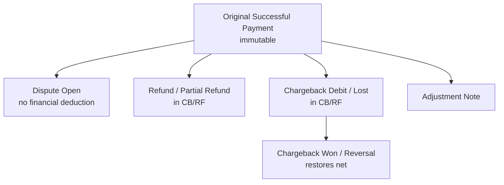

# Refunds Disputes Chargebacks

> [!abstract] Related
> [[Payments]] · [[Currency and Conversion]] · [[Dashboard and Reporting]] · [[Compliance]] · [[Audit Logs]] · [[Business Rules]] · [[00 Home]]

**CB/RF** = processed refunds + chargeback debits/losses − chargeback won/reversal amounts.

### 10.7 Refunds, Reversals, and Chargebacks

Any confirmed customer payment must support payment-level actions for Dispute, Refund, Partial Refund, Chargeback Debit/Loss, and Chargeback Won/Reversal. The original successful payment remains immutable; each action creates a linked payment_adjustment record and audit event.

#### 10.7.1 Payment Detail Actions

Authorized actions on a payment: Mark as Dispute, Record/Process Refund, Record Partial Refund, Record Chargeback Debit/Loss, Record Chargeback Won/Reversal, and Add Adjustment Note.

Adjustment fields: type, amount, reason/reason code, merchant reference/case ID, effective date, notes, evidence attachment (if enabled), created by, and timestamps.

Full and partial adjustments are supported. Cumulative financial deductions must not exceed the original payment amount unless an authorized correction workflow explicitly allows it.

Opening a dispute is informational until a merchant debit/refund is recorded. A Dispute Open status alone does not reduce revenue or CB/RF.

#### 10.7.2 Adjustment Statuses

| Type / Status | Financial Effect | CB/RF Rule |
| --- | --- | --- |
| Dispute Open / Under Review | No deduction by default | Shown separately; excluded from CB/RF until financial debit/refund. |
| Refund Processed | Deduct refund amount | Included in CB/RF on refund effective date. |
| Partial Refund Processed | Deduct partial amount | Included in CB/RF for processed amount only. |
| Chargeback Debited / Lost | Deduct chargeback amount | Included in CB/RF on debit/loss effective date. |
| Chargeback Won / Reversed | Restore prior deduction | Creates a reversing adjustment and reduces CB/RF impact. |
| Adjustment Cancelled | No effect | Retained for audit; excluded from financial totals. |

#### 10.7.3 Currency Rule for Refunds and Chargebacks

A refund or chargeback does not use the currently active conversion rate merely because it happens later. It is linked to the original payment. If the merchant provides the actual refund/debit amount in USD or AED, store that amount directly. If conversion is required internally, use the original payment's fixed_rate_snapshot, not today's rate.

Example: a January payment used USD -> AED 3.67. The rate later changes to 3.68. A refund/chargeback against the January payment references the January payment and its 3.67 snapshot (or the actual merchant debit amount).

## Related Documentation

### Depends On

- [[Payments]]
- [[Currency and Conversion]]
- [[Roles and Permissions]]

### Integrates With

- [[Audit Logs]]
- [[Dashboard and Reporting]]
- [[Compliance]]

### Technical

- [[Business Rules]]
- [[Testing]]

> [!danger] Financial immutability
> Confirmed financial transactions must preserve historical values. Corrections use adjustment/reversal workflows rather than silently editing historical records.
> Also see [[Invoices]] · [[Payments]] · [[Refunds Disputes Chargebacks]] · [[Currency and Conversion]] · [[Business Rules]] · [[Audit Logs]] · [[Testing]]

> [!warning] Payment adjustments
> Refunds, disputes, and chargebacks create linked adjustment records. The original successful payment remains preserved.
> Also see [[Payments]] · [[Refunds Disputes Chargebacks]] · [[Audit Logs]] · [[Dashboard and Reporting]] · [[Business Rules]] · [[Testing]]

> [!danger] Fixed conversion rates
> Rates are Admin-defined and versioned. Historical payments retain the exact rate snapshot used. Changing a rate affects future transactions only. Never fetch, guess, or substitute a market/gateway rate.
> Also see [[Currency and Conversion]] · [[Payments]] · [[Business Rules]] · [[Data Model]] · [[Dashboard and Reporting]] · [[Testing]]
