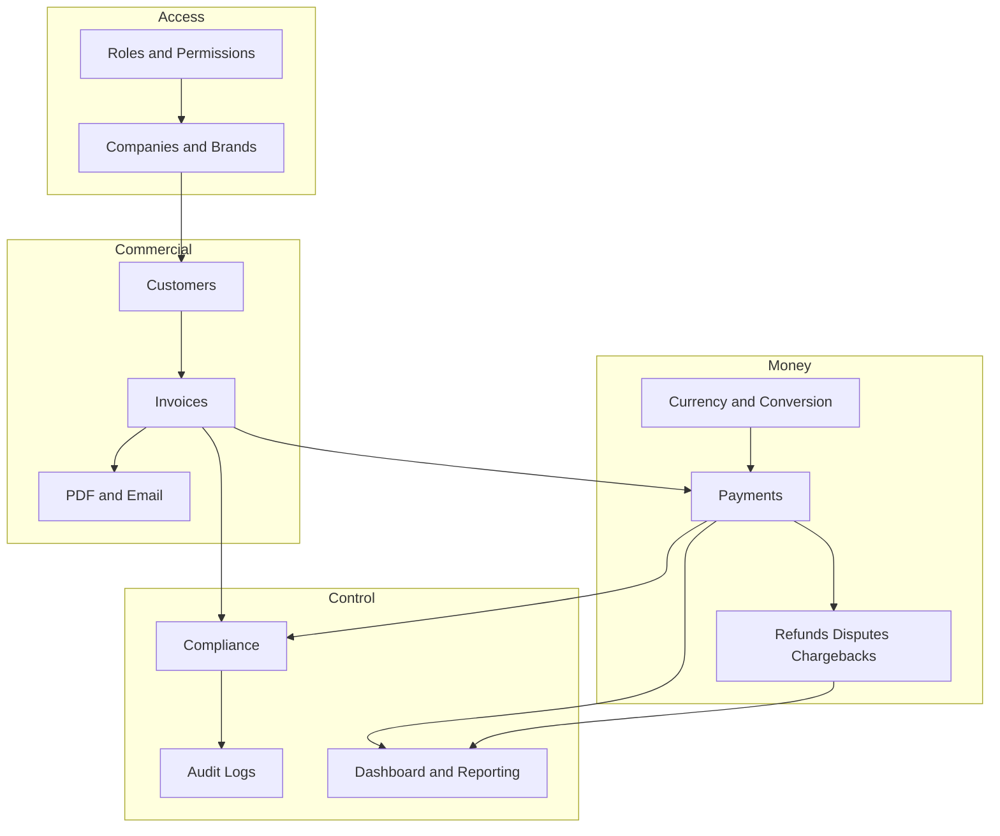

# Product Overview

> [!abstract] Related
> [[Product Goals]] · [[Definitions]] · [[Companies and Brands]] · [[Invoices]] · [[Payments]] · [[Business Rules]] · [[00 Home]]

> [!important] Core financial principle
> Financial history is **immutable**. Original invoice amount/currency, fixed conversion-rate snapshot, converted settlement amount, payment record, merchant fee, actual amount received, refunds, disputes, and chargebacks are independent records. Later rate or configuration changes must never silently recalculate history.

## Product Overview

This SaaS is an internal, web-based multi-brand invoicing and payment-management platform. A single master application manages multiple companies/brands while isolating company data and configuration. It centralizes authentication, customers, invoices, payments, fixed currency conversion, compliance, reporting, PDF/email delivery, administration, and immutable audit history.

### Core Financial Principle

Financial history is immutable. The original invoice amount/currency, fixed conversion-rate snapshot, converted settlement amount, payment record, merchant fee, actual amount received, refunds, disputes, and chargebacks must be preserved as independent records. Later rate or configuration changes must never silently recalculate historical transactions.

## Executive Feature Map

- Authentication, user management, RBAC, company assignments, session controls, optional MFA.
- Multi-company / multi-brand tenant architecture with per-brand identity, numbering, currencies, gateways, email identity, templates, and reporting.
- Reporting Groups / parent-company rollups for consolidated reporting.
- Customer master records reusable across authorized companies.
- Multi-currency invoicing with USD, AED, PKR, GBP, and AUD enabled by default; Admin can add currencies.
- Admin-defined fixed conversion rates with effective dates, version history, scheduling, and immutable payment snapshots.
- Invoice lifecycle from Draft through Sent/Issued, Partially Paid, Paid, Overdue, and Cancelled.
- Branded, versioned PDF invoices and per-brand email delivery.
- Stripe, PayPal, generic bank/card processor adapter, and manual payments.
- Partial payments, hosted checkout links, webhook processing, idempotency, and settlement reconciliation.
- Disputes, full/partial refunds, chargeback debit/loss, chargeback won/reversal, and adjustment history.
- Compliance review queues, approvals/flags, notes, reason codes, filters, and exports.
- Append-only audit history for security, financial, configuration, and operational actions.
- KPI dashboards, operational reports, monthly brand matrices, CB/RF reporting, reporting-group rollups, drill-downs, and exports.
- Configurable notifications, email templates, invoice numbering, payment methods, security/system settings, and refund/chargeback rules.
- Versioned backend API, gateway adapters, signed webhooks, background jobs, object storage, backups, monitoring, testing, and UAT controls.

---

## SaaS Modules

1. Authentication & Users
2. Roles & Permissions
3. Companies / Brands
4. Reporting Groups / Parent Companies
5. Currency Management
6. Fixed Conversion Rate Management
7. Customer Management
8. Invoice Management
9. PDF & Email Delivery
10. Payments & Gateway Integrations
11. Refunds, Disputes & Chargebacks
12. Compliance
13. Audit Logs
14. Dashboard & Reporting
15. Notifications
16. Settings & Administration
17. Screen / UI Inventory
18. Data Model
19. API & Integrations
20. Business Rules & Validation
21. Security, Performance & Data Integrity
22. Error Handling & Operational Controls
23. Testing & QA
24. Deployment, Backup & Environments

---

## Complete Source-Derived Specification

MULTI-BRAND
INVOICE MANAGEMENT SYSTEM

Software Requirements & Development Specification

| Document Type | Product Requirements + Technical Specification |
| --- | --- |
| Version | 1.2 |
| Date | 13 August 2026 |
| Target Release | Version 1 / MVP |
| Audience | Product Owner, UI/UX, Frontend, Backend, QA, DevOps |
| Item | Details |
| --- | --- |
| Customer portal | Out of scope for Version 1. |
| Payment settlement currencies | USD and AED initially; configurable for future expansion. |
| Default invoice currencies | USD, AED, PKR, GBP, AUD; additional currencies can be created by Admin. |

## 1. Executive Summary

The system will be an internal, web-based invoicing and payment management platform designed for multiple companies/brands operating under one master application. It will provide controlled access to Admin, Compliance, and Staff users and will centralize customers, invoices, payment records, currency conversion, reporting, PDF generation, email delivery, and audit history.

> [!important] Critical design principle
> Critical design principle Every financial record must preserve its original commercial value. The invoice amount/currency, Admin-defined fixed conversion rate snapshot, converted settlement amount, actual payment record, and any optional merchant fee must be stored independently. Merchant fees are never part of the conversion formula or invoice-balance calculation. Historical values must never be recalculated when Admin changes a fixed rate later.

### 1.1 Primary Outcomes

- Create and manage multiple brands/companies from a single master application.

- Create customers once and associate them with one or more companies when required.

- Create branded invoices in USD, AED, PKR, GBP, AUD, or any future Admin-created currency.

- Generate professional PDF invoices and email them to customers.

- Record and reconcile payments from Stripe, PayPal, bank/card processors, and manual payment methods.

- Convert invoice currency to settlement currency (initially USD/AED) using Admin-defined fixed conversion rates while preserving the original invoice value and the exact fixed-rate snapshot used.

- Maintain a versioned fixed-rate history so Admin can change rates monthly, yearly, or at any future effective date without recalculating historical transactions.

- Allow any confirmed customer payment to be marked as disputed, refunded, partially refunded, chargeback-debited/lost, or chargeback-won/reversed, with the original payment preserved and a linked adjustment history.

- Provide monthly/yearly brand reports modeled on the supplied spreadsheet layout: brand columns, month rows, Monthly Total, CB/RF, group totals, annual gross total, CB/RF total, and net grand total.

- Provide company-level and consolidated reporting.

- Provide granular role-based access for Admin, Compliance, and Staff.

- Maintain tamper-resistant audit logs and compliance review records.

## Related Documentation

### Depends On

- [[Product Goals]]
- [[Definitions]]
- [[Out of Scope]]

### Integrates With

- [[Companies and Brands]]
- [[Invoices]]
- [[Payments]]
- [[Business Rules]]

### Technical

- [[02 Architecture]]
- [[01 Master Spec]]
