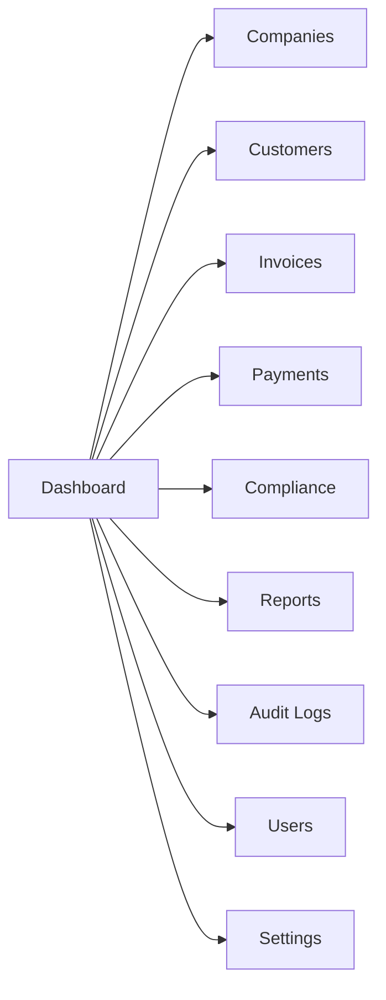

# Screen Inventory

> [!abstract] Related
> [[Product Overview]] · [[Invoices]] · [[Payments]] · [[Dashboard and Reporting]] · [[Settings]] · [[00 Home]]

| Area | Screens / Functions | Module |
| --- | --- | --- |
| Authentication | Login, Forgot Password, Reset Password, optional MFA challenge. | [[Roles and Permissions]] · [[Security]] |
| Dashboard | KPI cards, trend charts, recent invoices/payments, filters, company switcher. | [[Dashboard and Reporting]] · [[Companies and Brands]] |
| Companies | List, Create, Edit, View, Gateway Settings, Invoice Branding. | [[Companies and Brands]] · [[Payments]] |
| Customers | List/search/filter, Create, Edit, Profile. | [[Customers]] |
| Invoices | List/filter, Create/Edit Draft, View Invoice (TASK-032: `/invoices`, `/invoices/new`, `/invoices/{id}`, `/invoices/{id}/edit`). PDF Preview/Download/Print on invoice view (TASK-040/043). Duplicate Draft action (TASK-043). Email Modal + history on invoice view (TASK-042); optional hosted checkout method selection on send (TASK-058). Record Payment on invoice view (TASK-051). | [[Invoices]] · [[PDF and Email]] · [[Payments]] |
| Payments | Manual payment entry (TASK-051: `/payments/manual`). Transaction list, Payment detail, Refund/Adjustment view remain later. | [[Payments]] · [[Refunds Disputes Chargebacks]] |
| Compliance | Review queue, record detail, approve/flag, notes. | [[Compliance]] |
| Reports | Report selector, filters, tables/charts, export. | [[Dashboard and Reporting]] |
| Audit Logs | Filterable read-only log viewer. | [[Audit Logs]] |
| Users | List, Create, Edit role/company access, suspend. | [[Roles and Permissions]] · [[Settings]] |
| Currencies | Global currency list, create/edit/disable. | [[Currency and Conversion]] |
| Settings | System, email, numbering, fixed conversion rates. | [[Settings]] · [[Notifications]] |

### 16.1 Suggested Main Navigation

| Dashboard Companies Customers Invoices   - All / Draft / Sent / Partial / Paid / Overdue / Cancelled Payments Compliance Reports Audit Logs Users Settings |
| --- |

## Related Documentation

### Depends On

- [[Product Overview]]

### Integrates With

- [[Invoices]]
- [[Payments]]
- [[Dashboard and Reporting]]
- [[Settings]]
- [[Customers]]
- [[Compliance]]
- [[Audit Logs]]
- [[Companies and Brands]]

### Technical

- [[Roles and Permissions]]
