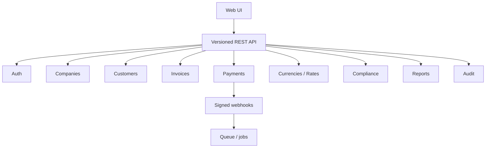

# API and Integrations

> [!important] Accepted HTTP boundary
> Next.js Route Handlers / Server Actions coordinate use cases. They must not contain core domain logic. Identity is Supabase Auth; authorization is application-owned. Payment providers are resolved through the registry in [[05 Architecture Decisions#ADR-008 — Payment provider architecture|ADR-008]] (`verifyWebhook()` is part of the provider contract; implement it in [[TASK-048 Payment Provider Abstraction]], not here).
> See [[02 Architecture]] and [[05 Architecture Decisions#ADR-020 — Next.js server layer|ADR-020]].

> [!abstract] Related
> [[Payments]] · [[Data Model]] · [[Security]] · [[Error Handling]] · [[Deployment]] · [[00 Home]]

The frontend should consume a versioned backend API. Even if the application is server-rendered, business logic should remain in reusable service/domain layers. Suggested endpoint groups are below; exact URLs may vary.

| API Group | Representative Operations |
| --- | --- |
| Auth | POST /api/auth/login, POST /api/auth/logout (TASK-003). POST /auth/forgot-password and /reset-password remain [[TASK-004 Password Reset and Session Controls]]. optional MFA endpoints later. |
| Companies | GET/POST /companies; GET/PATCH /companies/{id}; gateway and currency configuration subresources. |
| Customers | GET/POST /customers; GET/PATCH /customers/{id}; profile summary/invoices/payments. |
| Invoices | GET/POST /invoices; GET/PATCH /invoices/{id}; issue, cancel, duplicate, PDF, email actions. |
| Payments | GET/POST /payments; manual record endpoint; payment detail; refund/adjustment endpoints. |
| Gateways | Create checkout/payment request; provider status; webhook endpoints for Stripe/PayPal/bank processor. |
| Currencies | GET/POST/PATCH currencies; fixed-rates endpoint; company-enabled currency endpoint. |
| Compliance | Queues, review detail, status update, notes. |
| Reports | Parameterized report endpoints with pagination and export jobs/files. |
| Audit | Read-only filter endpoint for authorized roles. |
| Users | Admin CRUD, role/company assignment, suspend/reset. |

### 18.1 Webhook Requirements

- Dedicated webhook URL per provider or provider type.

- Validate webhook signatures using provider secrets.

- Store external event IDs and enforce unique processing for idempotency.

- Respond quickly; move heavy post-processing to queue/jobs if architecture supports it.

- Log processing result and correlation ID without logging sensitive secrets/card data.

- Support event retries safely.

### 18.2 Payment Provider Adapter Interface

| createPaymentRequest(invoice, settlementCurrency, convertedAmount) getPaymentStatus(externalTransactionId) parseWebhook(payload, headers) getFees(transaction)  # optional reconciliation only refundPayment(transaction, amount)  # if supported healthCheck() |
| --- |

Accepted architecture also requires `verifyWebhook()`, a provider registry, and capability flags. Implement the TypeScript contract in [[TASK-048 Payment Provider Abstraction]]. Do not hardcode provider names in core domain logic. See [[05 Architecture Decisions#ADR-008 — Payment provider architecture|ADR-008]].

## Related Documentation

### Depends On

- [[Security]]
- [[Data Model]]

### Integrates With

- [[Payments]]
- [[Error Handling]]
- [[Deployment]]

### Technical

- [[Testing]]
- [[02 Architecture]]

> [!warning] Company isolation
> Every company-scoped operation must enforce company access **server-side**. Frontend hiding is not authorization.
> Also see [[Roles and Permissions]] · [[Companies and Brands]] · [[Business Rules]] · [[Security]] · [[Data Model]] · [[API and Integrations]] · [[Testing]]
